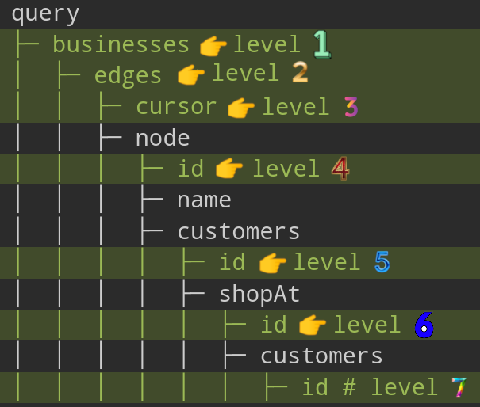

# Query Depth

- A defense mechanism against unbounded deeply nested GraphQL queries.
- We need to limit the **total depth** of each operation.
- My current implementation in `apps/complexity` + [`ComplexityPlugin`](../libs/shared/src/services/complexity-plugin/) is doing just that but it lacks taking into account the Connection pagination (learn more [here](https://github.com/sonofmagic/graphql-depth-limit-ts/issues/14)).
- Deciding when a GraphQL query is "too complex" is a nuanced and subtle art.

# [`@escape.tech/graphql-armor`](https://www.npmjs.com/package/@escape.tech/graphql-armor)

> [!NOTE]
>
> At first I thought to use `graphql-depth-limit-ts`, but then I found `@escape.tech/graphql-armor`. It offers features provided by `graphql-query-complexity` and `graphql-depth-limit-ts`. So I am down :joy:.

I am gonna try this lib with `type-graphql`. **The e2e tests + app:** `apps/depth` and `apps/depth-e2e`.

1. ```shell
   pnpm install graphql type-graphql reflect-metadata typeorm pg @escape.tech/graphql-armor
   ```
2. ```shell
   nx g @nx/node:app apps/depth --framework express --bundler esbuild
   ```
3. Configure your [TypeORM](https://typeorm.io/#quick-start) and [`type-graphql`](https://typegraphql.com/docs/getting-started.html) backend.
4. Configure your `@escape.tech/graphql-armor` with your Apollo Server ([learn more](https://escape.tech/graphql-armor/docs/getting-started/#apollo-server)).

For example this query with that config will work:

<table>
<thead>
<tr>
<th>GraphQL Query</th>
<th>Config</th>
</tr>
</thead>
<tbody>
<tr>
<td>

```graphql
query {
  businesses {
    edges {
      cursor
      node {
        id
        name
        customers {
          id
          shopAt {
            id
            customers {
              id
            }
          }
        }
      }
    }
  }
}
```

</td>
<td>

```ts
new ApolloArmor({
  maxDepth: {
    enabled: true,
    ignoreIntrospection: true,
    n: 7,
    flattenFragments: true,
  },
  costLimit: {
    enabled: true,
    depthCostFactor: 1.5,
    objectCost: 2,
    scalarCost: 1,
    ignoreIntrospection: true,
    flattenFragments: true,
    maxCost: 100,
  },
});
```

</td>
</tr>
</tbody>
</table>

- We have 7 as the maximum level of nestedness. That corresponds to the `n: 7` in our `maxDepth`.

  

- After that we can take a look at how it is calculating our GraphQL query's cost, we have said `depthCostFactor` should be **1.5**, `objectCost` should be **2**, and finally `scalarCost` is **1**. Let's first break down our query

  **Cost calculation formula**: `objectCost` + (child complexity \* `depthCostFactor`). You can see how I know that this lib **at the time of writing this doc** is using this formula [here](https://github.com/Escape-Technologies/graphql-armor/discussions/754#discussioncomment-11695446).

  <table>
    <thead>
      <tr>
        <th>Depth</th>
        <th>Field</th>
        <th>Type</th>
        <th>Base Cost</th>
        <th>Child Cost * Depth Factor</th>
        <th>Total Cost</th>
      </tr>
    </thead>
    <tbody>
      <tr>
        <td>0</td>
        <td><code>query</code></td>
        <td>Object</td>
        <td>n/a</td>
        <td>n/a</td>
        <td>n/a</td>
      </tr>
      <tr>
        <td>1</td>
        <td><code>businesses</code></td>
        <td>Object</td>
        <td>2</td>
        <td>7 * 1.5</td>
        <td>12.5</td>
      </tr>
      <tr>
        <td>2</td>
        <td><code>edges</code></td>
        <td>Object</td>
        <td>2</td>
        <td>6 * 1.5</td>
        <td>11</td>
      </tr>
      <tr>
        <td>3</td>
        <td><code>cursor</code>, <code>node</code></td>
        <td>Scalar + Object</td>
        <td>1 + 2</td>
        <td>9 * 1.5</td>
        <td>16.5</td>
      </tr>
      <tr>
        <td>4</td>
        <td><code>id</code>, <code>name</code>, <code>customers</code></td>
        <td>Scalar + Scalar + Object</td>
        <td>1 + 1 + 2</td>
        <td>6 * 1.5</td>
        <td>13</td>
      </tr>
      <tr>
        <td>5</td>
        <td><code>id</code>, <code>shopAt</code></td>
        <td>Scalar + Object</td>
        <td>1 + 2</td>
        <td>3 * 1.5</td>
        <td>7.5</td>
      </tr>
      <tr>
        <td>6</td>
        <td><code>id</code>, <code>customers</code></td>
        <td>Scalar + Object</td>
        <td>1 + 2</td>
        <td>1 * 1.5</td>
        <td>4.5</td>
      </tr>
      <tr>
        <td>7</td>
        <td><code>id</code></td>
        <td>Scalar</td>
        <td>1</td>
        <td>0</td>
        <td>1</td>
      </tr>
      <tr>
        <th colspan="5">Cost Of Executing This Query</th>
        <th>66</th>
      </tr>
    </tbody>
  </table>
