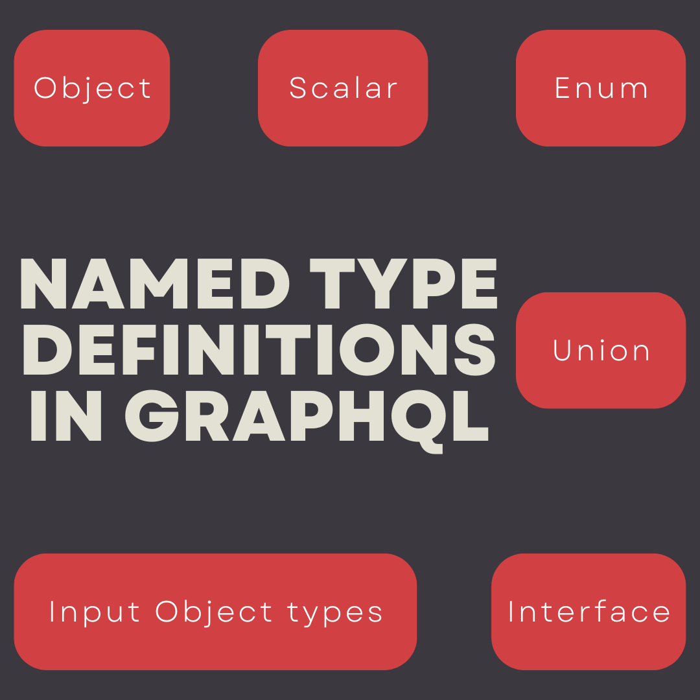
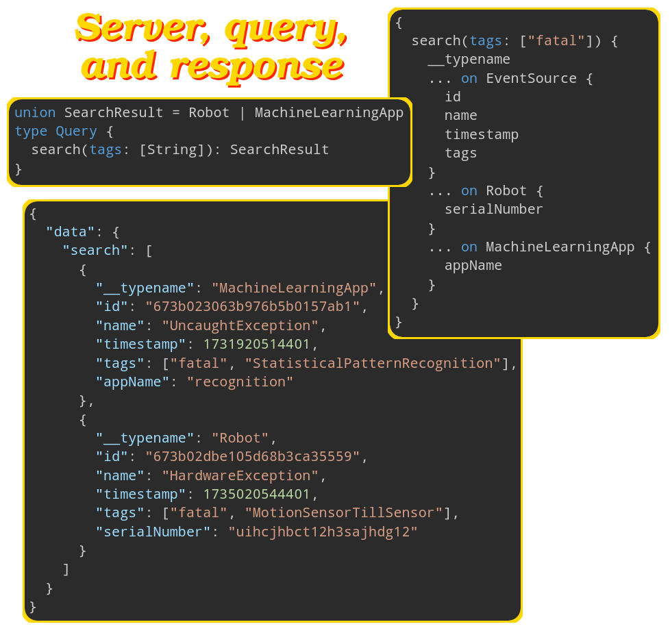

# An overview



# Data types -- Scalar

- Specify the types for your API using the GraphQL schema language.
  - In other word they describe what data can be queried from the API.
- <a href="basicScalarTypes">#</a> Supports the [scalar types](./glossary.md#scalarValueDefinition) and we can use them directly in our schema:
  - `Int`: A signed 32‐bit integer.
  - `Float`: A signed double-precision floating-point value.
  - `String`: A UTF‐8 character sequence.
  - `Boolean`: `true` or `false`.
  - `ID`:
    - Serialized in the same way as a `String`.
    - Intended to convey meaning rather than dictate a format.
- By default, every type is nullable.
- Define mandatory fields by adding exclamation mark (`!`) at the end of a field name.
- `[String]` means a list of strings.
- Just return plain old JavaScript objects in APIs that return scalar types.
- Scalar types cannot have sub-selections in the query.
- The leaf values of the query.

Code: [https://github.com/kasir-barati/graphql-js-ts/tree/main/apps/scalar-types](https://github.com/kasir-barati/graphql-js-ts/tree/main/apps/scalar-types).

## Define custom scalar types

- You must define how the new custom scalar type should be:
  - Serialized.
  - Deserialized.
  - Validated.
- [E.g. `scalar Date`](../apps/profile/src/utils/date-scalar-type.util.ts).
- Your client-side also knows how it should work with that custom scalar type.

# Fetch data

## Passing arguments

- Define the arguments in the schema language.
- Typechecking happens automatically. No need to write extra code to:
  - Enforce mandatory/optional fields.
  - Enforce basic type enforcements.
- Still need to do more validation, things like a string is a strong password, or email validation? Then you need to write your own custom validator.

Code: [https://github.com/kasir-barati/graphql-js-ts/blob/122a487b29ec9c4b8610fe87498dfc6bae7463e1/apps/scalar-types/src/main.ts#L16](https://github.com/kasir-barati/graphql-js-ts/blob/122a487b29ec9c4b8610fe87498dfc6bae7463e1/apps/scalar-types/src/main.ts#L16).

## Define custom types -- Objects

- Define a new object type.
- The same way we define the `Query` type.
- Each object can have:
  - Fields that return a particular type; `email: String!`.
  - Methods that take arguments; `setNickName(nickName: String!)`.
- If you return that custom type then you'll be able to call its properties/methods too:

  

  Now let's look at the wrong and correct way of querying this particular query:

  | Wrong usage                                                                                                                               | Correct usage                                                                                                                       |
  | ----------------------------------------------------------------------------------------------------------------------------------------- | ----------------------------------------------------------------------------------------------------------------------------------- |
  | https://github.com/kasir-barati/graphql-js-ts/blob/abe288c3dc3db225fe639250f446fe2a45cfc273/docs/assets/wrong-get-die-query.graphql#L1-L5 | https://github.com/kasir-barati/graphql-js-ts/blob/abe288c3dc3db225fe639250f446fe2a45cfc273/docs/assets/get-die-query.graphql#L1-L9 |

  Why should we use this approach?

  1. Instead of several separate request you can get them all in one go.
  2. Less bandwidth usage and server load.
  3. It is safe and easy to work with:
     - On the backend we get to decide which method/property should be exposed.
     - In our frontend we get a much cleaner way to fetch data.
  4. Better UX since user do not have to wait a long time for the data.

Code: [https://github.com/kasir-barati/graphql-js-ts/blob/main/apps/scalar-types/src/main.ts](https://github.com/kasir-barati/graphql-js-ts/blob/main/apps/scalar-types/src/main.ts).

# Mutate data

- Use a `Mutation` endpoint instead of `Query`.
- Define the API endpoint as part of the top-level `Mutation` operation type.
- E.g. a profile endpoint where you can change your info or fetch it.

## Input Object type

In NestJS we usually have this concept of DTOs where we define incoming data's structure for create endpoint and reuse the same DTO for the update endpoint since they accept the same stuff.

In GraphQL we can do the same thing, but within the GraphQL syntax boundaries; i.e. we can use `input` keyword to define our incoming data type.

> [!CAUTION]
>
> `Input` types can **NOT** have:
>
> - Fields that are other objects, only:
>   - [Basic scalar types](#basicScalarTypes).
>   - List types.
>   - Or other input types (this is the same concept of nested objects that we have in NestJS).
> - Arguments either.

> [!TIP]
>
> Naming convention for `input` types: add `Input` postfix to the base name.

Following example's schema definition:

1. https://github.com/kasir-barati/graphql-js-ts/blob/cc9666b59d67392a89075531dbbd960683482fb8/apps/profile/src/main.ts#L24-L29

2. https://github.com/kasir-barati/graphql-js-ts/blob/cc9666b59d67392a89075531dbbd960683482fb8/apps/profile/src/main.ts#L44-L52


Code: [https://github.com/kasir-barati/graphql-js-ts/tree/main/apps/profile](https://github.com/kasir-barati/graphql-js-ts/tree/main/apps/profile).

# Enums

- AKA enumeration types.
- A special kind of scalar type.
- Is restricted to a particular set of allowed values.

```graphql
enum TodoStatus {
  CREATED
  IN_PROGRESS
  COMPLETED
  ARCHIVED
  DELETED
}
```

# Interfaces & unions

These are what you might call _abstract types_.

## `interface`

- A group of fields that must be included and implemented in either:
  - **A concrete** Object type.
  - Or other `Interface` types.
- They can implement each other.
- **NO** cyclic implementation is allowed!
- **NO** self implementation is allowed!
- They clarify shared behavior or purpose.
- Do **NOT** use it just to enforce shared field names.
- E.g. for a audit-log object I would have a very basic interface and some concrete types:

  ```graphql
  # Define a shared interface for received data
  interface EventData {
    after: String
    before: String
  }
  # Define a shared interface for all sources
  interface EventSource implements EventData {
    id: ID!
    name: String!
    timestamp: Int!
    requestId: String!
    tags: [String!]!

    data: EventData!
  }
  # Robot type implements the EventSource interface
  type Robot implements EventSource {
    id: ID!
    name: String!
    timestamp: Int!
    requestId: String!
    tags: [String!]!
    data: EventData!

    serialNumber: String!
  }
  # ML Application type implements the EventSource interface
  type MachineLearningApp implements EventSource {
    id: ID!
    name: String!
    timestamp: Int!
    requestId: String!
    tags: [String!]!
    data: EventData!

    appName: String!
  }
  ```

## `union`

- Similar to a `interface`.
- Cannot define any shared fields among the constituent types.
  - I.e the types included in a union can have completely unrelated structures, and GraphQL does not enforce that they share any fields.
- Cannot use `interface` or another `union` inside a `union`.
- Examples:

  - <a href="#auditLogUnionExample" id="auditLogUnionExample">#</a> audit-log example

    

  - ```graphql
    union SearchResult = Issue | Code
    type Issue {
      id: ID!
      Repo: Repository
      title: String
      content: String
    }
    type Code {
      line: Int
      Repo: RepositoryWithCommitSha
      fileLanguage: ProgrammingLanguage
    }
    ```

- Need [inline fragments](./queries-and-mutations.md#work-with-generic-types-and-concrete-ones----inline-fragments) to be able to query `interface` specific parts.

## Ref

- [https://graphql.org/graphql-js/authentication-and-express-middleware/](https://graphql.org/graphql-js/authentication-and-express-middleware/).
