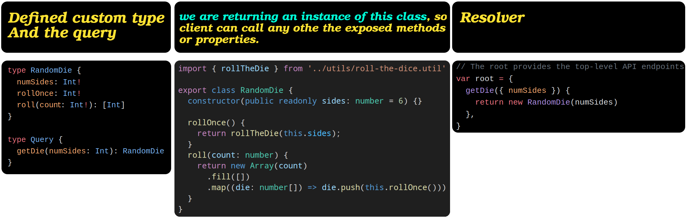
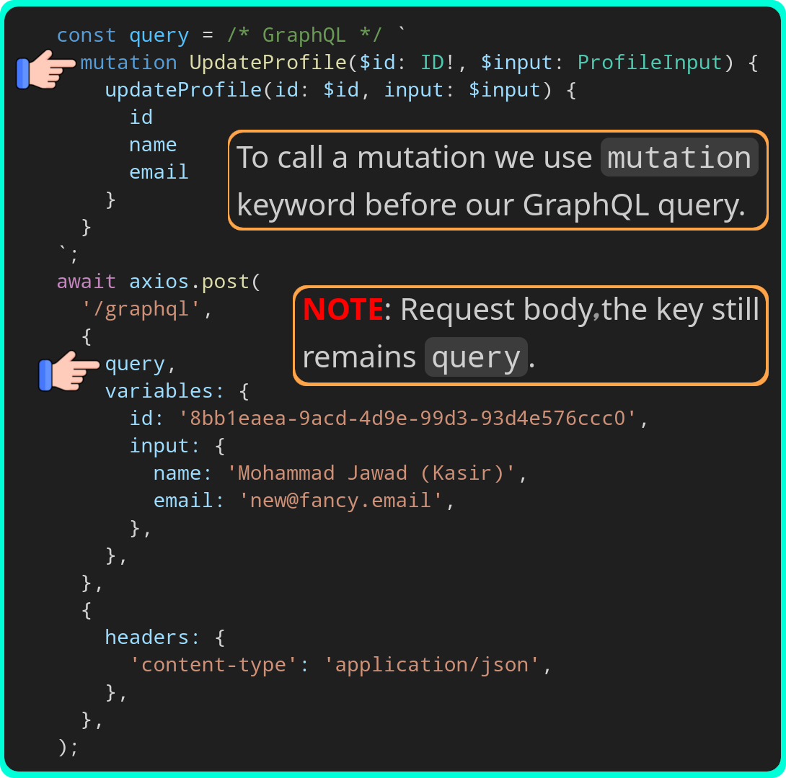

# Data types

- Specify the types for your API using the GraphQL schema language.
- <a href="basicScalarTypes">#</a> Supports the [scalar types](./glossary.md#scalarValueDefinition) and we can use them directly in our schema:
  - `Int`.
  - `Float`.
  - `String`.
  - `Boolean`.
  - `ID` (intended to convey meaning rather than dictate a format).
- By default, every type is nullable.
- Defined mandatory fields by adding exclamation mark at the end of a field name.
- `[String]` means a list of strings.
- Just return plain old JavaScript objects in APIs that return scalar types.

Code: [https://github.com/kasir-barati/graphql/tree/main/apps/scalar-types](https://github.com/kasir-barati/graphql/tree/main/apps/scalar-types).

# Fetch data

## Passing arguments

- Define the arguments in the schema language.
- Typechecking happens automatically. No need to write extra code to:
  - Enforce mandatory/optional fields.
  - Enforce basic type enforcements.
- Still need to do more validation, things like a string is a strong password, or email validation? Then you need to write your own custom validator.

Code: [https://github.com/kasir-barati/graphql/blob/122a487b29ec9c4b8610fe87498dfc6bae7463e1/apps/scalar-types/src/main.ts#L16](https://github.com/kasir-barati/graphql/blob/122a487b29ec9c4b8610fe87498dfc6bae7463e1/apps/scalar-types/src/main.ts#L16).

## Define custom types

- Define a new object type.
- The same way we define the `Query` type.
- Each object can have:
  - Fields that return a particular type; `email: String!`.
  - Methods that take arguments; `setNickName(nickName: String!)`.
- If you return that custom type then you'll be able to call its properties/methods too:

  

  Now let's look at the wrong and correct way of querying this particular query:

  | Wrong usage                                                                                                                         | Correct usage                                                                                                                 |
  | ----------------------------------------------------------------------------------------------------------------------------------- | ----------------------------------------------------------------------------------------------------------------------------- |
  | https://github.com/kasir-barati/graphql/blob/abe288c3dc3db225fe639250f446fe2a45cfc273/docs/assets/wrong-get-die-query.graphql#L1-L5 | https://github.com/kasir-barati/graphql/blob/abe288c3dc3db225fe639250f446fe2a45cfc273/docs/assets/get-die-query.graphql#L1-L9 |

  Why should we use this approach?

  1. Instead of several separate request you can get them all in one go.
  2. Less bandwidth usage and server load.
  3. It is safe and easy to work with:
     - On the backend we get to decide which method/property should be exposed.
     - In our frontend we get a much cleaner way to fetch data.
  4. Better UX since user do not have to wait a long time for the data.

Code: [https://github.com/kasir-barati/graphql/blob/main/apps/scalar-types/src/main.ts](https://github.com/kasir-barati/graphql/blob/main/apps/scalar-types/src/main.ts).

# Mutate data

- Use a `Mutation` endpoint instead of `Query`.
- Define the API endpoint as part of the top-level `Mutation` type.
- E.g. a profile endpoint where you can change your info or fetch it.
- In NestJS we usually have this concept of DTOs where we define incoming data's structure for create endpoint and reuse the same DTO for the update endpoint since they accept the same stuff.

  In GraphQL we can do the same thing, but within the GraphQL syntax; i.e. we can use `input` keyword to define our incoming data type.

  > [!CAUTION]
  >
  > `Input` types can **NOT** have fields that are other objects, only:
  >
  > - [Basic scalar types](#basicScalarTypes).
  > - List types.
  > - Or other input types (this is the same concept of nested objects that we have in NestJS).

  > [!TIP]
  >
  > Naming convention for `input` types: add `Input` postfix to the base name.

Code: [https://github.com/kasir-barati/graphql/tree/main/apps/profile](https://github.com/kasir-barati/graphql/tree/main/apps/profile).

## Ref

- [https://graphql.org/graphql-js/authentication-and-express-middleware/](https://graphql.org/graphql-js/authentication-and-express-middleware/).
