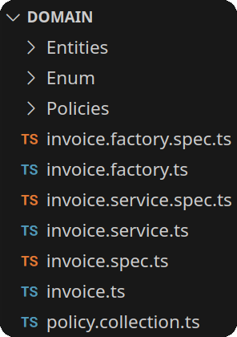
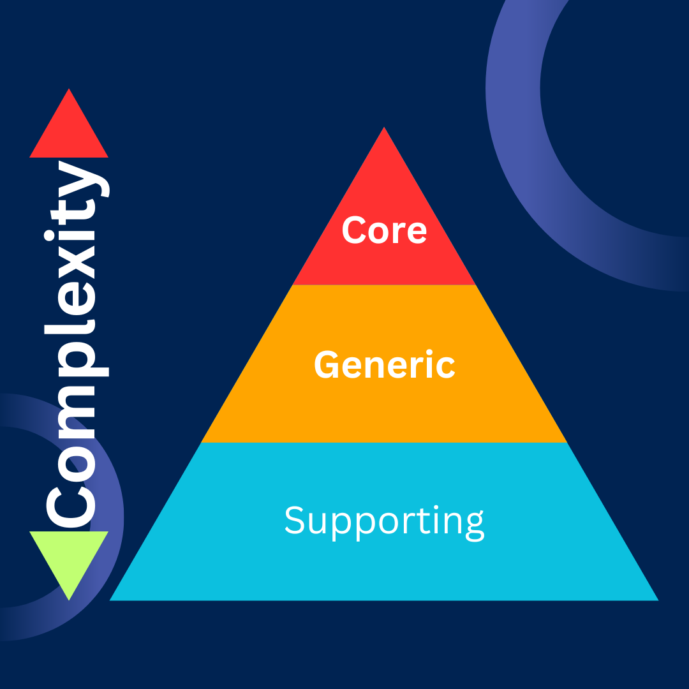
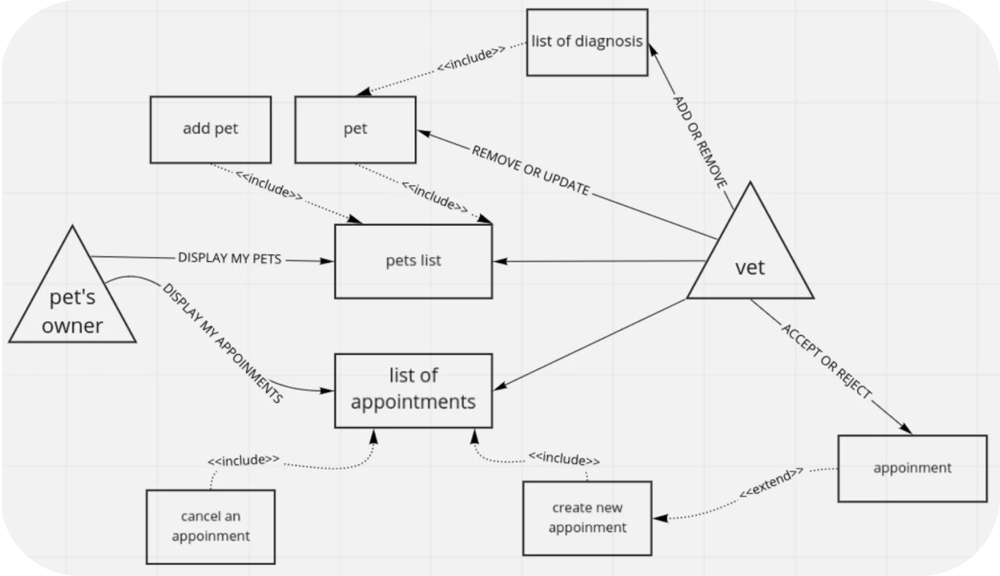
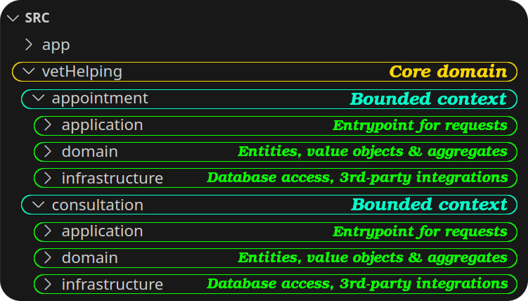

# Intro

So why knowing the concept of DDD is important? because:

- Then we **understand how companies operate within their business**.
- We can **design good systems that are aligned with the business goals**.
- Understanding the business is a fundamental requirement to **build successful software solutions**.
- Helps break down a complex problem space into smaller, manageable "domains".
- Foster effective communication through shared, precise vocab ([learn more about **ubiquitous language**](https://www.amazon.com/Domain-Driven-Design-Tackling-Complexity-Software/dp/0321125215)).
- Maps business logics/rules/assumptions to the domains:
  - <b>Correct reflection of business rules in code</b>.
  - E.g. for a payment refund it should have been paid in full.
- DDD is about having a mental model shared by business people and devs.
- Clarifies on what each team is working, less miscommunication.
- The names of classes, variables and other implementation components should be consistent with a business [nomenclature](https://dictionary.cambridge.org/dictionary/english/nomenclature).

> [!CAUTION]
>
> <a href="#temporaryApplicationDefinition" id="temporaryApplicationDefinition">#</a> To simplify things let's just think that we only have an API. So for the time being let's say <b>_application_ = our backend</b>.

# [Domain](https://dictionary.cambridge.org/dictionary/english/domain)

- A specific area of a business.
- A certain thematic area in business.
- A specific area of knowledge, business logic, or functionality.
- A [problem space](./glossary.md#problemSpaceDefinitionInDomainDriverDesign) concept that reflects a segment of the business.

> [!NOTE]
>
> By "specific area", or "certain thematic area" we meant to say **[coherent](https://dictionary.cambridge.org/dictionary/english/coherent) and atomic**.

- Subject matter or problem space that your [application](#temporaryApplicationDefinition) is designed to handle.
- All of them together form the [business domain](./glossary.md#businessDomainInDomainDrivenDesign).
  - We model domains based on business's needs.
  - [Building blocks](./glossary.md#buildingBlockInDomainDrivenDesign) for your [application](#temporaryApplicationDefinition)'s functionality.
    - In other word, an implementation is created with consistency which reflects business rules by using building blocks.
- AKA a "group" or a "module".

## Palpable example in TS

<figure>
  <figcaption>
    A simple invoice billing domain files & folders.
  </figcaption>
  
</figure>

## The cost of DDD

- It asks for upfront investment:
  - Meetings with experts in that business.
  - A thorough understanding of the problems & needs of business.
- **Not good** when you have a small project such as multiple CRUD, which are usually not complicated.
- **Good when** your project involves the implementation of a large system with extensive business assumptions.

## Different types of domains

<table>
  <caption>
    <ul align="left">
      <li>DDD is very elastic.</li>
      <li>DDD allows you to use it in specified parts of your solution.</li>
      <li>DDD + simple CRUD + external modules is OK.</li>
      <li>
        From a strategic perspective we usually group them by their complexity and importance for a company.
      </li>
    </ul>
  </caption>
  <thead>
    <tr>
      <th colspan="3">
Categories
</th>
    </tr>
    <tr>
      <th>
Core
</th>
      <th>
Generic
</th>
      <th>
Supporting
</th>
    </tr>
  </thead>
  <tbody>
    <tr>
      <td id="coreDomainDefinition">
        <ul>
          <li>AKA core domains.</li>
          <li>What differentiates a company from another.</li>
          <li>The <b>innovation that a company introduces</b> to gain an advantage over its competitors <b>(company's competitive advantage)</b>.</li>
          <li>If it is simple to implement is also simple to copy.</li>
          <li><b>Not necessarily technical</b>. E.g. an ECommerce app for a carpenter.</li>
          <li><b>Change often</b> (where you need to not stagnate).</li>
          <li>Core features of the API.</li>
          <li>Will be the core purpose of your application.</li>
          <li>The problem your software solution wants to solve.</li>
        </ul>
      </td>
      <td>
        <ul>
          <li>Business <b>activities that all companies do</b> in the same way.</li>
          <li>Ready-to-use implementations are widely available.</li>
          <li>No real need for innovation or proprietary solutions here, <b>e.g. auth</b>.</li>
          <li>Contains logic which from a strategic perspective is not important as other core domain.</li>
        </ul>
      </td>
      <td>
        <ul>
          <li>Necessary functions that <b>enable the core domain to operate</b> effectively.</li>
          <li>No real competitive advantage or business differentiation.</li>
          <li>The main criterion for distinguishing them: they're <b>simple to implement</b>.</li>
          <li>Usually CRUD-based systems.</li>
        </ul>
      </td>
    </tr>
  </tbody>
</table>

#### Complexity of different types of domains

## Identifying boundaries of domains

**Separate core domains from the rest**, ensuring proper design decisions. To do so we need meetings with domain experts and together try to understand obtained knowledge about the system.

- Core domains are defined by the:
  - Company's business strategy.
  - Company's [business domain](./glossary.md#businessDomainInDomainDrivenDesign).
- Core domain use cases usually involve the same entities, and perform operations over closely related data:
  - Identify key entities; look at the nouns in the problem description or business process.
  - Map relationships; how do these entities interact?
  - Focus on user needs; think about what the users of the app need to interact with.
  - Leverage business logic; look at the operations and rules specific to the domain.
- In those meetings you can use:
  - Simple ubiquitous language with [UML](https://en.wikipedia.org/wiki/Unified_Modeling_Language).
  - [Custom notation](./glossary.md#customNotationsDefinitionInDomainDrivenDesign).

### Some examples

  
Vet helping system

  

    Client says something like this:
  

  <blockquote>
    I have a lot of patients nowadays and still, I'm using a notebook to schedule appointments and classic paper patients' documentations. It's hard for me to work with patients and at the same time scheduling visits or exporting patients' diagnoses for their owners. I can't afford a secretary in the long run so I've decided to implement a schedule and diagnosis system which won't need my attention to book patients or share the diagnosis with owners.
  </blockquote>
  <figure>
    <figcaption align="center">
      The custom notation of the entire flow of our vet helping system with authenticated users.
    </figcaption>
    
  </figure>
  <ul>
    <li>
      The most important thing to you is to automate the registration process or provide a mechanism for storing a patient's diagnosis and data.
      <ul>
        <li>We don't have to use DDD for everything; authentication module is a normal module.</li>
        <li>
          <b>Core domain</b>
          <ul>
            <li>Scheduling an appointment, canceling and list our appointments.</li>
            <li>
              Attach consultation/diagnosis results during an appointment to registered pets and allow to read diagnosis for pets' owners.
            </li>
          </ul>
        </li>
      </ul>
    </li>
    <li>
      Less emphasis on the invoice system, which can be e.g. bought from an external company.
       
      Or you can implement it on your own, but as simple as it's possible. <b>The invoice module is a generic domain</b>.
    </li>
    <li>
      <b>Implement a module responsible for calculating health level of a pet</b>. A number between 0 to 10.Calculated according to the pet's blood tests results, diagnosis, and subjective vet mark.
       
      A cool feature to show that information or use it by the vet to make some decisions but it's not important business logic. This is a <b>supportive domain</b>.
    </li>
  </ul>
  
Project structure for this example.

  <figure>
    
    <figcaption align="center">
      <aside>
        A <a href="./glossary.md#boundedContextDefinitionInDomainDrivenDesign">bounded context</a> is a technical boundary where a specific model applies, and that model is shaped by the domain it serves.
         
        A bounded context is part of <a href="./glossary.md#solutionSpaceDefinitionInDomainDriverDesign">solution space</a> context that encapsulates the model of a domain and ensures its integrity.
      <aside>
    </figcaption>
  </figure>

## Refs

1. [Domain Driven Design: domain what?](https://concisesoftware.com/blog/domain-driven-design).
2. [Domain Driven Design: discovering domains](https://concisesoftware.com/blog/domain-driven-design-discovering-domains/).
3. [Confused about Bounded Contexts and SubDomains](https://stackoverflow.com/q/18625576/8784518).
4. [What actually is a subdomain in domain-driven design?](https://stackoverflow.com/a/73080428/8784518).
