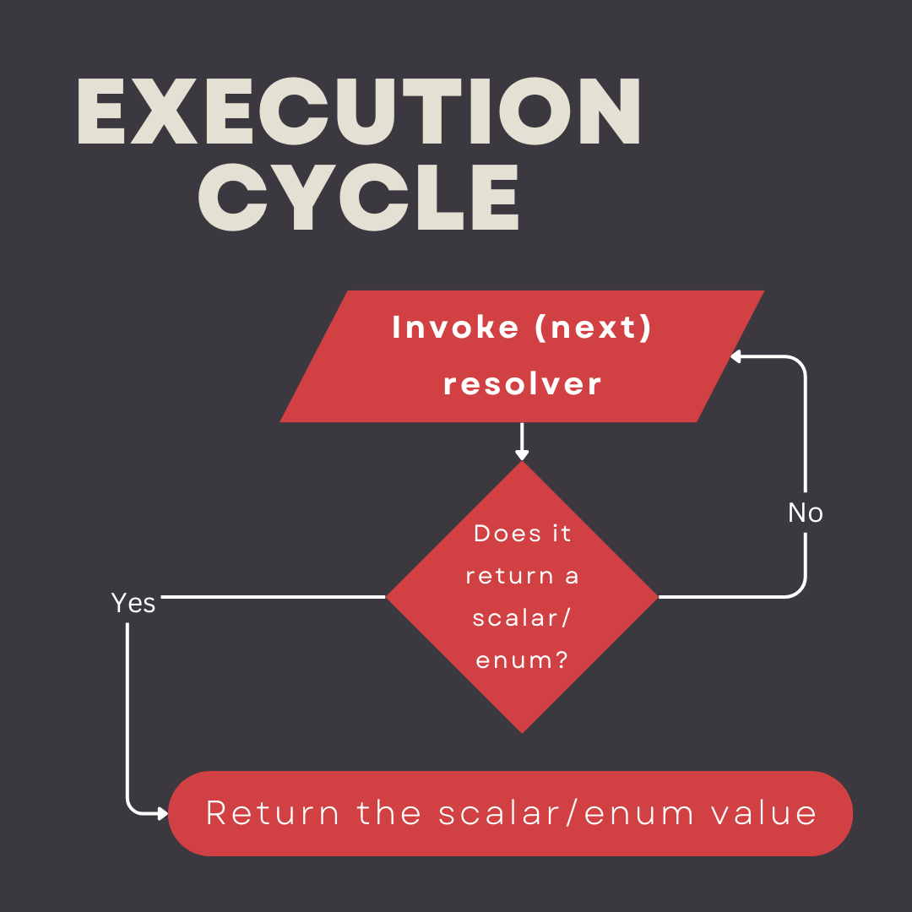
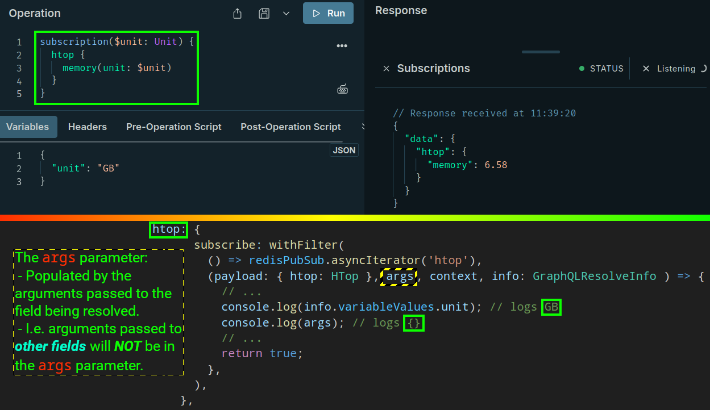
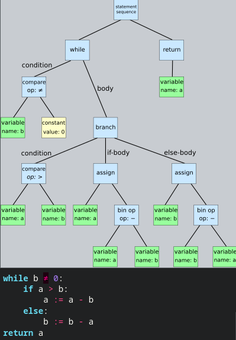
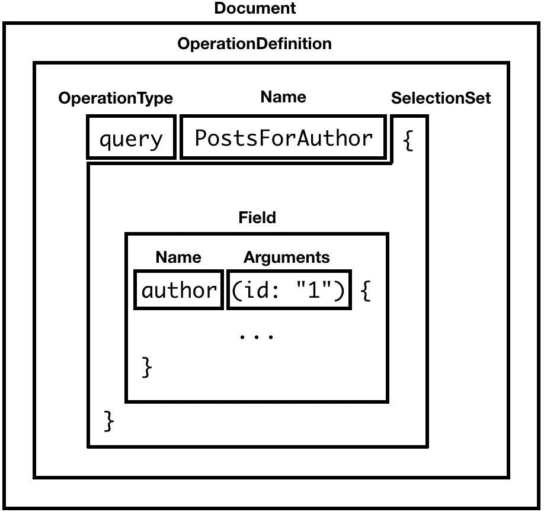
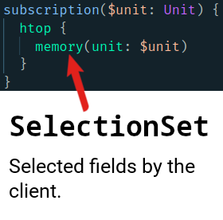

# Execution from inside

- Each field defined in a [type system](./glossary.md#typeSystemDefinitionInGraphql) behaves like a function.
- Each field returns the next type.
- Each field on each type is backed by a resolver function.

  - E.g. when [here](https://github.com/kasir-barati/graphql-js-ts/blob/63439cd4029023736636e039a1ddea2686b974b3/apps/scalar-types/src/main.ts#L30) we are returning a `RandomDie` and inside that type we have `roll` and `rollOnce` which are also considered resolvers.

    Though we never really passed them explicitly as resolver to our `rootApi` variable.

- The execution stops when you return a scalar/enum type -- [like `Todo` object type](https://github.com/kasir-barati/graphql-js-ts/blob/63439cd4029023736636e039a1ddea2686b974b3/apps/todo-backend/src/schema.ts#L10-L20).



## Resolvers

<a href="#fourArgumentsOfAnyResolverFunction" id="fourArgumentsOfAnyResolverFunction">#</a> A resolver function receives 4 arguments in this specific order:

```ts
async function getTodo(
  /**
   * @description
   * The previous object.
   *
   * - AKA root, or parent.
   * - A GraphQL server needs to call the resolvers of a query’s fields. GraphQL does a breadth-first (level-by-level) resolver call. The root argument in each resolver call is simply the result of the previous call.
   * - Mostly won't be used.
   */
  obj,
  /**
   * @description
   * Arguments/parameters passed to a field in a GraphQL operation.
   * @example `getTodo(id: ID!)`
   */
  args: { id: string },
  /**
   * @description
   * An object that every resolver can write to and read from it so that resolvers can communicate.
   *
   * Holds important contextual information, things like:
   * - Access to a database.
   * - The currently logged in user.
   */
  context: { db: PrismaClient },
  /**
   * @description
   * The Abstract Syntax Tree representation of a query or mutation.
   *
   * Holds field-specific* info and the schema details.
   *
   * *Things relevant to the current operation.
   */
  info,
) {
  const todo = await context.db.todo.find({
    where: { id: args.id },
  });
  const graphqlTodoObject = new GraphqlTodo(todo);

  return graphqlTodoObject;
}
class GraphqlTodo {
  public id: string;
  public title: string;
  public content: string;
  public createdAt: Date;
  public updatedAt: Date;
  public CreatedBy: { id: string; username: string };
  public createdById: string;
  public AssignedTo: { id: string; username: string };
  public assignedToId: string;

  constructor(todo: PrismaTodo) {
    this.id = todo.id;
    this.title = todo.title;
    this.content = todo.content;
    this.createdAt = todo.createdAt;
    this.updatedAt = todo.updatedAt;
    this.CreatedBy = todo.CreatedBy;
    this.createdById = todo.createdById;
    this.AssignedTo = todo.AssignedTo;
    this.assignedToId = todo.assignedToId;
  }
}
```

### An Important Note About `args` in a Resolver



&mdash; [Ref](https://stackoverflow.com/a/55716584/8784518).

> [!NOTE]
>
> I've demystified the `info` object in GraphQL [here](./resolve-info-object.md).

### <a id="trivialResolvers" href="#trivialResolvers">#</a> No Need to Define Trivial Resolvers Like `getTodoName`

```ts
import { GraphQLResolveInfo } from 'graphql';

function getTodoName(
  obj: GraphqlTodo,
  args,
  context,
  info: GraphQLResolveInfo,
) {
  return obj.name;
}
```

Most of the times when we have not defined a resolver the lib we're using to build our GraphQL service assume that there is a property/method named exactly the same as the field. Thus it automatically calls that one.

### What is AST

- Stands for Abstract Syntax Tree.
- A data structure.
- A very broad term used in computer science ([wiki](https://en.wikipedia.org/wiki/Abstract_syntax_tree)).
- Represents the structure of a program, code snippet, or a GraphQL query.
- A tree representation of the abstract syntactic structure of text (often source code, but here a GraphQL query) written in a [formal language](https://en.wikipedia.org/wiki/Formal_language).
  - Formal language essentially is a language that consciously and deliberately is designed to express a set of particular concepts without ambiguity.
  - <a id="lexicalAnalysis" href="#lexicalAnalysis">#</a> In GraphQL a query comes in as a string, this string must be [split into meaningful sub-strings](#tokenization) and parsed into a representation that the machine understands.
  - <details>
      <summary>
        An example of an AST for a code
      </summary>
      
      <br />
      <a href="./assets/Abstract_syntax_tree_for_Euclidean_algorithm.svg">Same image better quality</a>
    </details>

#### [Tokenization](https://en.wikipedia.org/wiki/Lexical_analysis#Tokenization)

- A lexical token is a string with an assigned and thus identified meaning, in contrast to the probabilistic token used in large language models. AKA lexing (or lexical analysis).
- [Here](https://spec.graphql.org/October2021/#sec-Language.Lexical-Analysis-Syntactic-Parse) you can find out about the rules the GraphQL lexer uses to tokenize your query.
- [Here is our lexer in `graphql`](https://github.com/graphql/graphql-js/blob/48afd37a48d37f6d3342b959e8cb34e1ecbfeffb/src/language/lexer.ts).

##### A GraphQL Query Parts After Tokenization



- Its root is called [`Document`](https://spec.graphql.org/October2021/#sec-Document).
- A `Document` can have one or many `Definition`.
  - A Definition is either:
    - A [`OperationDefinition`](https://spec.graphql.org/October2021/#OperationDefinition).
    - Or `FragmentDefinition`.
  - It contains at least one `OperationDefinition`.
- An `OperationDefinition` is:

  - The [`OperationType`](https://spec.graphql.org/October2021/#OperationType) followed by an optional given `Name`.

    - E.g. `query GetUsers...`

  - Then usually we define our [`SelectionSet`](https://spec.graphql.org/October2021/#sec-Selection-Sets).

    

  It accepts more than this and you can see a complete list [here](https://spec.graphql.org/October2021/#OperationDefinition).

- You can see here how [`graphql`'s parser uses `Lexer` to parse a GraphQL query](https://github.com/graphql/graphql-js/blob/48afd37a48d37f6d3342b959e8cb34e1ecbfeffb/src/language/parser.ts#L193).

## Ref

- [Life of a GraphQL Query — Lexing/Parsing](https://medium.com/@cjoudrey/life-of-a-graphql-query-lexing-parsing-ca7c5045fad8).
