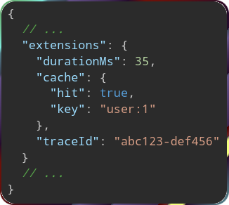
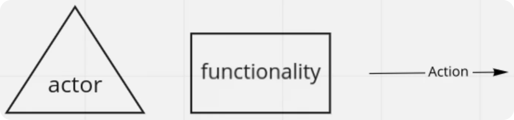
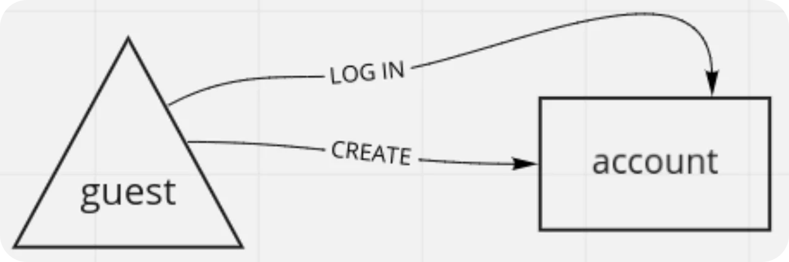
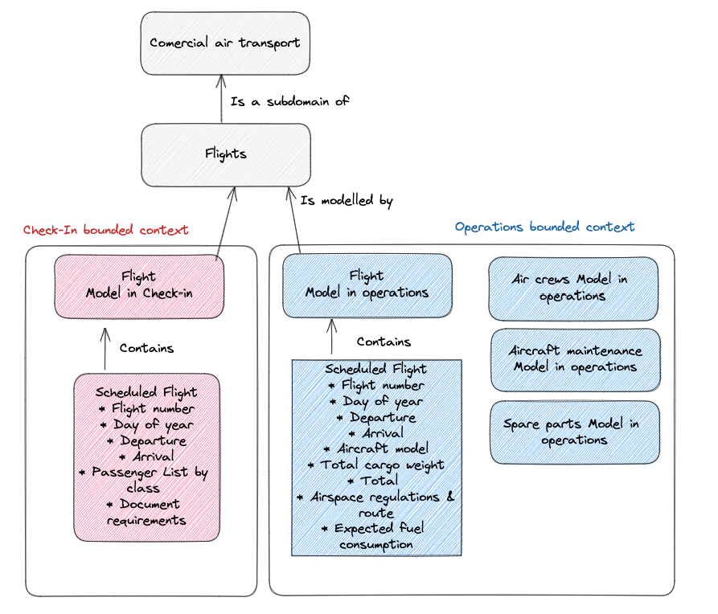

<dl>
  <dt id="queryLanguageDefinition">
    <a href="#queryLanguageDefinition">#</a>
    Query language
  </dt>
  <dd>
    A structured way to request specific data or operations from an API. 
  </dd>
  <dd>
    Allows clients (e.g. web or mobile apps) to ask for exactly the data they need from the server by writing queries.
  </dd>
  <dt id="graphqlOperationDefinition">
    <a href="#graphqlOperationDefinition">#</a>
    GraphQL operation
  </dt>
  <dd>
    The thing that the client sends to the GraphQL server.
  </dd>
  <dt id="serverSideRuntimeDefinition">
    <a href="#serverSideRuntimeDefinition">#</a>
    Server-side runtime
  </dt>
  <dd>
    The environment and processes on the server that interpret and execute <b>GraphQL queries</b>.
  </dd>
  <dd>
    The GraphQL server-side runtime is a specific layer <b>within</b> the backend.
  </dd>
  <dd>A specialized component of the backend.</dd>
  <dt id="typeSystemDefinitionInGraphql">
    <a href="#typeSystemDefinitionInGraphql">#</a>
    Type system
  </dt>
  <dd>A structured definition of the data types, fields, and relationships available within the API.</dd>
  <dd>Acts as a blueprint for both the client and server.</dd>
  <dd>
    <pre>
Describes what kind of data can be requested,
          what shape that data will have,
          how different data pieces are connected.
    </pre>
  </dd>
  <dt id="scalarValueDefinition">
    <a href="#scalarValueDefinition">#</a>
    Scalar value
  </dt>
  <dd>
    It comes from linear algebra.
  </dd>
  <dd>
    We use it to differentiate a single number from a vector or matrix. 
  </dd>
  <dd>
    <a href="https://softwareengineering.stackexchange.com/q/238033/408819">Read more</a>.
  </dd>
  <dt id="firstClassWayDefinition">
    <a href="#firstClassWayDefinition">#</a>
    First-class way
  </dt>
  <dd>
    GraphQL provides a built-in, standardized, and recommended approach.
  </dd>
  <dt id="telemetryDataDefinition">
    <a href="#telemetryDataDefinition">#</a>
    Telemetry data
  </dt>
  <dd>
    In general: the automated collection, transmission, and analysis of data related to the performance, status, or behavior of a system, device, or application.
  </dd>
  <dd>
    In GraphQL: info about the operation or performance of the GraphQL server during the execution of a query.
  </dd>
  <dd>
    
  </dd>
  <dt id="rateLimitConsumptionDefinition">
    <a href="#rateLimitConsumptionDefinition">#</a>
    Rate limit consumption
  </dt>
  <dd>
    How much of the allocated request allowance (rate limit) a client has used when interacting with an API.
  </dd>
  <dd>Enforce rate limits to control traffic, and prevent abuse.</dd>
  <dd>
    Usually maximum number of requests or operations a client can perform within a specific time frame.
  </dd>
  <dt id="businessDomainInDomainDrivenDesign">
    <a href="#businessDomainInDomainDrivenDesign">#</a>
    Business domain
  </dt>
  <dd>
    

      
In one sentence: <b>Primary area of operation</b> of the company.

      

        E.g., Starbucks is renowned for its coffee, while DHL offers global delivery services.
         
        They can operate in <b>multiple business domains</b> too; e.g. Amazon operates in both retail and cloud computing.
         
        Resembles what we call it <a href="#coreDomainDefinition">core subdomains</a>.
      

    

  </dd>
  <dd>
    Like a wrapper around everything, a container.
  </dd>
  <dt id="buildingBlockInDomainDrivenDesign">
    <a href="#buildingBlockInDomainDrivenDesign">#</a>
    Building blocks
  </dt>
  <dd>
    Different pieces of business can be expressed with many different implementation elements, these elements are called building blocks.
  </dd>
  <dd>
    Entities that represent real-world concepts or logical parts of the domain.
  </dd>
  <dd>
    Directly create the code in the domain.
  </dd>
  <dd>
    Things like:
    <ul>
      <li>Aggregates.</li>
      <li>Entities.</li>
      <li>Policies.</li>
      <li>Services.</li>
      <li>Factories.</li>
      <li>Builders.</li>
      <li>Domain events.</li>
  </dd>
  <dt id="customNotationsDefinitionInDomainDrivenDesign">
    <a href="#customNotationsDefinitionInDomainDrivenDesign">#</a>
    Custom notation
  </dt>
  <dd>
    Unique or tailored way of representing system components, processes, or workflows that doesn't adhere to standard notations like <a href="https://en.wikipedia.org/wiki/Unified_Modeling_Language">UML (Unified Modeling Language)</a> or <a href="https://en.wikipedia.org/wiki/Business_Process_Model_and_Notation">BPMN (Business Process Model and Notation)</a>.
  </dd>
  <dd>
    In other word some standards that you establish within your company and team.
  </dd>
  <dd>
    
    
  </dd>
  <dt id="boundedContextDefinitionInDomainDrivenDesign">
    <a href="#boundedContextDefinitionInDomainDrivenDesign">#</a>
    Bounded context
  </dt>
  <dd>
    An area of your application which has explicitly defined borders, has its own Model, and maintains its own code.
  </dd>
  <dd>Within it everything should be strictly consistent.</dd>
  <dd>A desirable goal is to align domains 1:1 with bounded contexts.</dd>
  <dd>Similar with SRP of SOLID</dd>
  <dd>
    E.g. book has a very different model in different "bounded contexts":
     
    
     
    So Amazon may have a very complex "book" domain with lots of attributes, <b>BUT</b> only some of them would be relevant in different bounded contexts.
     
    
     
    &mdash; <a href="https://stackoverflow.com/a/75485118/8784518">Ref</a>
  </dd>
  <dt id="problemSpaceDefinitionInDomainDriverDesign">
    <a href="#problemSpaceDefinitionInDomainDriverDesign">#</a>
    Problem space
  </dt>
  <dd>A set of all problems that your product can solve.</dd>
  <dd>A term that defines the needs of customers for a product.</dd>
  <dd>
    It's about learning what kind of problems a user have. Then we can determine what the product needs to do.
  </dd>
  <dd>Best way to find a problem space: talking to real people and listening carefully.</dd>
  <dd>The foundation of a <a href="#solutionSpaceDefinitionInDomainDriverDesign">solution space</a>.</dd>
  <dd>Also look at <a href="#problem-space-vs-solution-space">problem space VS solution space</a>.<dd>
  <dt id="solutionSpaceDefinitionInDomainDriverDesign">
    <a href="#solutionSpaceDefinitionInDomainDriverDesign">#</a>
    Solution space
  </dt>
  <dd>A set of all solutions that solve any given problem..</dd>
  <dd>Anything that depends on or is built upon the problem space.</dd>
  <dd>Things like mockups, prototypes, and wireframes.</dd>
  <dd>Also look at <a href="#problem-space-vs-solution-space">problem space VS solution space</a>.<dd>
</dl>

## Problem space VS solution space

&mdash; [Ref](https://userstorymap.io/problem-space-vs-solution-space/).
