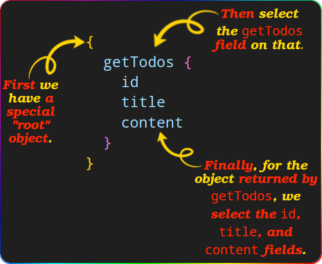
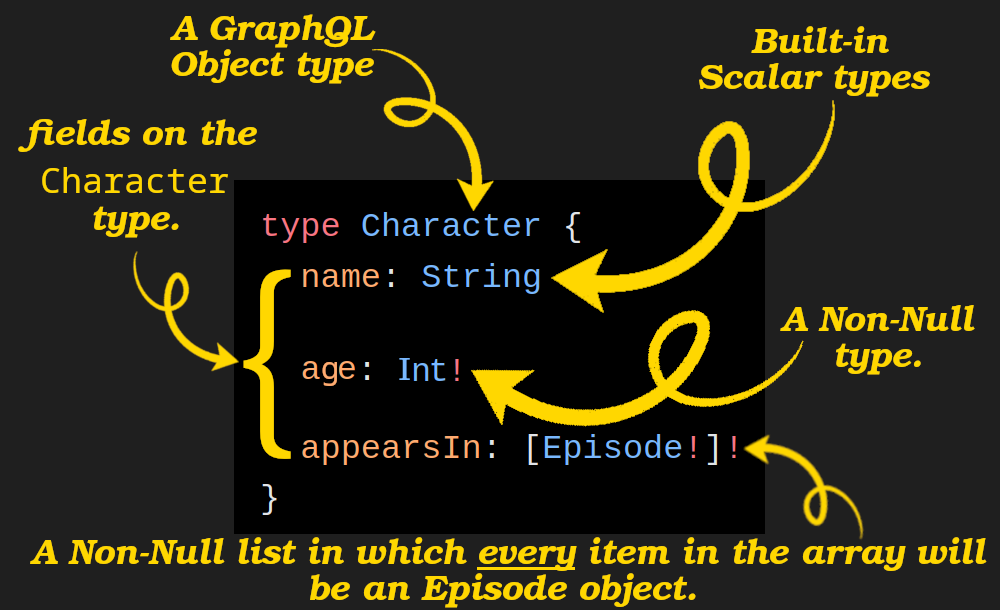
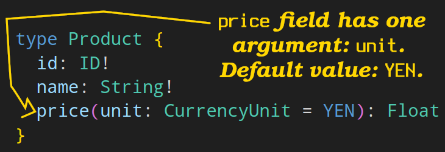
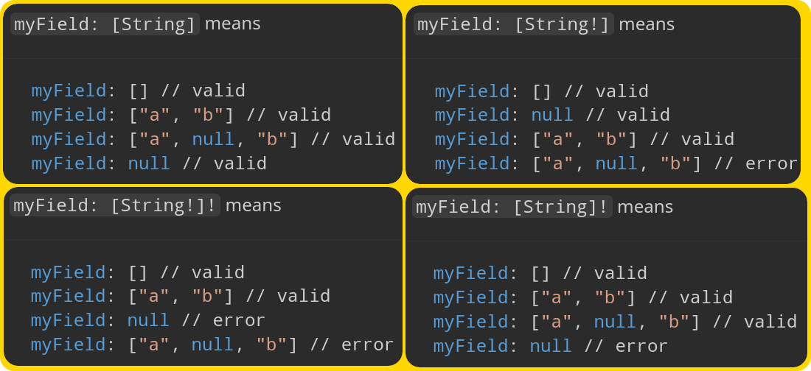
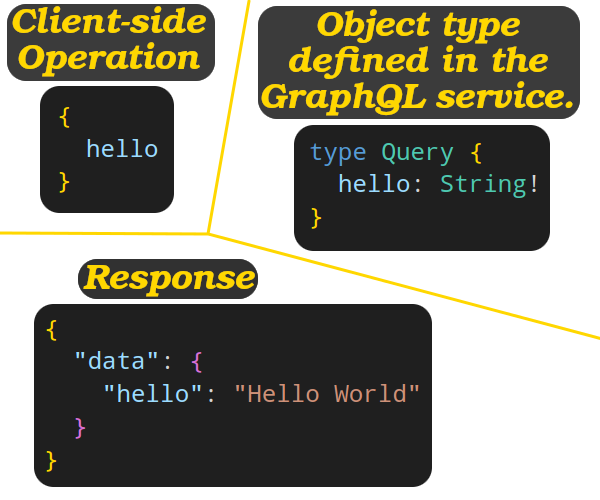

# Diagnose GraphQL query language



- In a GraphQL service we define our schema and then the incoming requests will be validated against it.
- Approaches in defining the schema:
  - All-in-One Definition: define the schema directly in your code.
  - Using Schema Definition Language (SDL): define schema in a separate file.
  - Schema inferred from code: you have resolvers annotated with decorators, then a lib will generate the schema based on your code.
  - Infer schema and resolver from the underlying database.

## Jargons





<dl>
  <dt id="GraphQLObjectTypeJargon">GraphQL Object type</dt>
  <dd>A type with some fields.</dd>
  <dt id="FieldJargon">Field</dt>
  <dd>
    Fields that can appear in any part of a GraphQL query that operates on the
    <code>Character</code>
    type.
  </dd>
  <dt id="ListTypeJargon">List type</dt>
  <dd>An array of the specified type.</dd>
  <dd><b>Cannot</b> define a non-empty list (an array with at least one member).</dd>
  <dd>A type modifier.</dd>
  <dt id="NonNullTypeJargon">Non-Null type</dt>
  <dd>The GraphQL service promises to give you a value whenever you query this field.</dd>
  <dd>A type modifier.</dd>
  <dt id="ArgumentJargon">Argument</dt>
  <dd>Arguments in GraphQL are passed by name specifically. Order does not matter!</dd>
  <dd>All arguments are named.</dd>
  <dd>Every field on a GraphQL Object type can have zero or more arguments.</dd>
  <dd>Can be required or optional.</dd>
</dl>

> [!TIP]
>
> `[type]` VS `[type]!` VS `[type!]` VS `[type!]!`
>
> 

## The Query, Mutation, and Subscription types

> [!IMPORTANT]
>
> - Every GraphQL schema must support `query` operations.
> - The entry point of a "root" operation type is a regular Object type called `Query` by default.
>
> 

- `Query`, `Mutation`, and `Subscription` are entry points of my GraphQL API.

  - Note that they should start with a capital letter and the same name as they are listed here.
  - If you want to use a custom name, you can do it. But then you need to tell GraphQL about it:

    ```graphql
    type MySubscriptionType {
      todoStatusChange: Todo!
    }
    type MyMutationType {
      createTodo: Todo!
    }
    type MyQueryType {
      getTodos: [Todo]
    }
    schema {
      query: MyQueryType
      mutation: MyMutationType
      subscription: MySubscriptionType
    }
    ```
