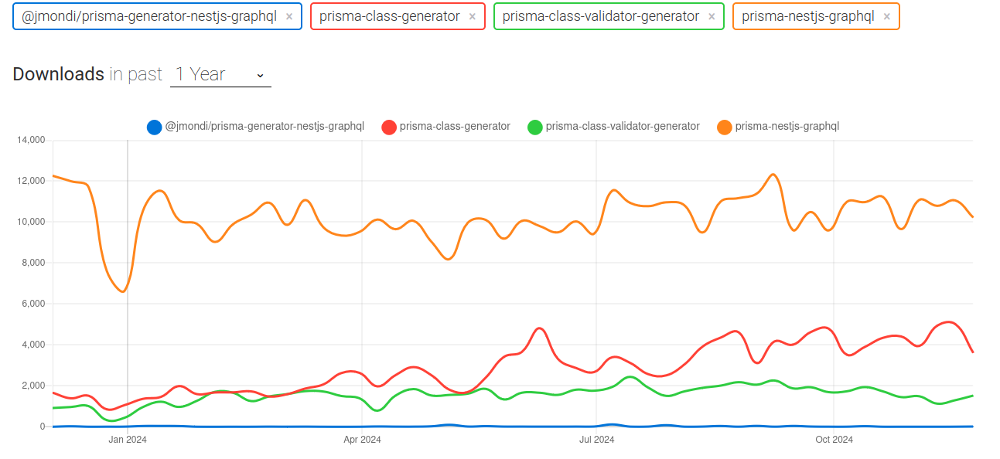

# Filtering using [`prisma-nestjs-graphql`](https://github.com/unlight/prisma-nestjs-graphql)

1. ```shell
   pnpm add @paljs/plugins
   pnpm add --save-dev prisma-nestjs-graphql
   nx add @nx-tools/nx-prisma
   nx g @nx-tools/nx-prisma:configuration --project botprobe-nest --database postgresql
   ```

   > [!NOTE]
   >
   > - `@paljs/plugin` will hlp us to fetch exactly the data that we wanted. Though please note that it is not gonna solve [the N+1 issue](../nestjs.md#shouldWeUseResolveField).
   > - Change the project name to whatever is yours.
   > - If your models have `Decimal` or `JSON` types, you need to install:
   >
   >   ```shell
   >   pnpm add graphql-type-json prisma-graphql-type-decimal
   >   ```
   >
   >   Or we can create custom graphql scalar types for these types ([learn more](https://docs.nestjs.com/graphql/scalars)).

2. ```prisma
   generator nestgraphql {
     provider = "node node_modules/prisma-nestjs-graphql"
     output   = "../src/@generated"
   }
   ```

   - Do not forget to add the `@generated` entry to your `.gitignore`.
   - You can use `emitSingle` to have a single index file containing all the generated args, etc.
   - Add `requireSingleFieldsInWhereUniqueInput` in case your table has only one field.

3. ```shell
   cd apps/botprobe-nest
   nest g module alert
   nest g service alert
   nest g resolver alert
   nest g module alert-type
   nest g service alert-type
   nest g resolver alert-type
   ```
4. Check `apps/botprobe-nest` to see what goes inside those files.
5. And to see how you should write e2e tests read the `apps/botprobe-nest-e2e`.
6. Use `///` to customize the generated code:

   - [`/// @HideField()`](https://github.com/unlight/prisma-nestjs-graphql?tab=readme-ov-file#hidefield).
   - For class-validator you need to:

     1. ```shell
        pnpm add class-validator class-transformer
        ```
     2. ```ts
        // src/main.ts
        import { ValidationPipe } from '@nestjs/common';
        // ...
        app.useGlobalPipes(new ValidationPipe());
        // ...
        ```
     3. ```prisma
        generator nestgraphql {
          fields_Validator_from = "class-validator"
          fields_Validator_input = true
        }
        // ...
        model User {
          // ...
          /// @Validator.MinLength(3)
          name String
          // ...
        }
        // ...
        ```

        Find more examples in `apps/botprobe-nest`.

> ![IMPORTANT]
>
> According to my experiences with this lib there are a couple of things which needs your consideration:
>
> 1. [The naming of input types does not make sense](https://github.com/unlight/prisma-nestjs-graphql/issues/226).
> 2. [Optional fields are not optional in the generated TS class](https://github.com/unlight/prisma-nestjs-graphql/issues/225).
> 3. In `apps/botprobe-nest` I used `@paljs/plugin` which simplifies selecting the fields that client asked for. But be aware of these issues:
>    - [Prisma still sends separates queries to the underlying database](https://github.com/paljs/prisma-tools/issues/347).
> 4. `prisma-nestjs-graphql` does not [delete the previous @generated before generating the new one (purgeOutput)](https://github.com/unlight/prisma-nestjs-graphql/issues/224).
> 5. [Weird naming for `*CreateInput`](https://github.com/unlight/prisma-nestjs-graphql/issues/226).
> 6. I did a quick npmtrends and it seems that this lib reign supreme:
>
>    
