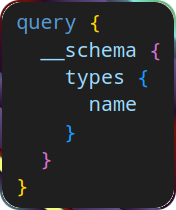
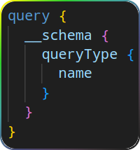
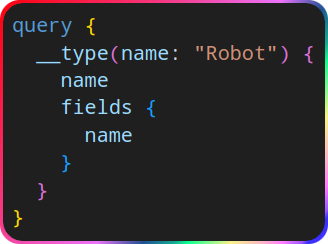

# Introspection system

- Query information about a GraphQL schema -- features it supports.
- [According to Merriam-Webster "introspection"](https://www.merriam-webster.com/dictionary/introspection) means a reflective looking inward.
- A special kind of query.
- Allow you to learn about a GraphQL API’s schema.

> [!TIP]
>
> GraphQL APIs designed exclusively for in-house applications, we typically won't add introspection service in production env. In fact disabling introspection service can be considered part of a security strategy.
>
> To disable it you can use 3rd-party libs such as [graphql-disable-introspection](https://www.npmjs.com/package/graphql-disable-introspection).

## `__typename`

- Ask GraphQL to tell us about the type of object.
- Can be added to any object.

## `__schema`

- Returns available types.
- Always available on the `query` root operation type.

<table>
  <thead>
    <tr>
      <th>Operation</th>
      <th>Response</th>
    </tr>
  </thead>
  <tbody>
    <tr>
      <td></td>
      <td>
        <ol>
          <li>
            Types defined by us: <code>Robot</code>, <code>SearchResult</code>, <code>Mutation</code>, <code>EventSource</code>, etc.
          </li>
          <li>
            <a href="./data-types.md#data-types----scalar">Built-in scalars</a>
          </li>
          <li>
            Types preceded/prefixed with a double underscore which are part of the introspection system itself:
            <ul>
              <li><code>__Schema</code>.</li>
              <li><code>__Type</code>.</li>
              <li><code>__TypeKin</code>.</li>
              <li><code>__Field</code>.</li>
              <li><code>__InputValue</code>.</li>
              <li><code>__EnumValue</code>.</li>
              <li><code>__Directive</code>.</li>
              <li><code>__DirectiveLocation</code>.</li>
            </ul>
          </li>
        </ol>
      </td>
    </tr>
    <tr>
      <td>
        
      </td>
      <td>
        The response in JSON format look like <a href="./assets/query-name-of-entrypoint.response.png">this</a>. The entrypoint of available queries which is usually called <code>Query</code>.
      </td>
    </tr>
    <tr>
      <td>
        
      </td>
      <td>
        The response in JSON format look like <a href="./assets/query-fields-of-a-specific-object.response.png">this</a>. Essentially it is an array of fields with filed name inside it.
      </td>
    </tr>
  </tbody>
</table>
