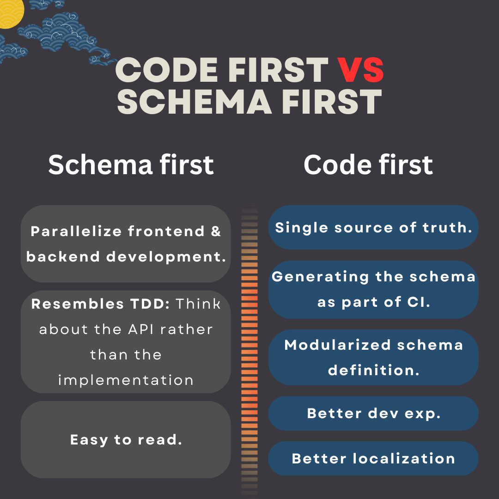

# NestJS + GraphQL

- GraphQL + TS = better type safety when writing GraphQL queries, end-to-end typing.
<!-- - We use [Apollo server](https://www.apollographql.com/docs/apollo-server). To do that we need [`@nestjs/apollo`](https://www.npmjs.com/package/@nestjs/apollo).
- We will use [Mercurius](https://github.com/mercurius-js/mercurius) which uses [Fastify](https://fastify.dev/) to implement:

  - GraphQL servers.
  - Gateways.

  For this we need [`@nestjs/mercurius`](https://www.npmjs.com/package/@nestjs/mercurius).

> [!NOTE]
>
> NestJS says in its doc that they **provide official integrations** for these GraphQL packages. That's good enough for me to pick these libs.

-->

## Schema first VS Code first

Nest offers both ways of building GraphQL applications, you can learn which one works best for you [here](https://www.reddit.com/r/graphql/comments/rvxlhx/codefirst_vs_schemafirst_approach/?utm_source=share&utm_medium=web3x&utm_name=web3xcss&utm_term=1&utm_content=share_button), and [here](https://www.reddit.com/r/graphql/comments/fpkx7a/codefirst_vs_schemafirst_development/?utm_source=share&utm_medium=web3x&utm_name=web3xcss&utm_term=1&utm_content=share_button). Regardless of which method you use, the GraphQL playground shows the schema. **My conclusion**:

-  Schema first:
  - Write your GraphQL API via SDL.
  - **Parallelize** frontend & backend development.
  - **Resembles TDD**: Think about the API rather than the implementation.
  - **Easy to read**.
  - Keep resolvers and schema in sync manually.
  - It relies on [default resolvers](./execution-from-inside.md#trivialResolvers).
-  Code first:
  - Generates the SDL from your code.
    - Use decorators and classes to generate the corresponding GraphQL schema.
  - **Single source of truth**.
  - **Generating the schema** can be done automatically as part of our **CI**.
    - [Legibility](https://dictionary.cambridge.org/dictionary/english/legibility): Types can be ordered alphabetically.
    - Can be committed to another repo like what GH does ([ref](https://github.com/octokit/graphql-schema)).
  - Enables us to **modularize schema definition**.
  - **Better dev exp**.
  - **Can do better on localization**, [related issue in GraphQL spec GH repo](https://github.com/graphql/graphql-spec/issues/193).



## Bootstrap your NestJS backend in Nx

<!-- `pnpm add @nestjs/graphql @nestjs/mercurius graphql mercurius`. -->

1. ```shell
   pnpm i @nestjs/graphql @nestjs/apollo @apollo/server graphql
   ```
2. ```shell
   nx g @nx/node:app --framework nest --directory apps/todo-nest
   ```
3. Update your `tsconfig*.json` files to use `NodeNext` instead of `CommonJS`.
4. ```shell
   nx serve todo-nest --configuration=production
   ```
5. Now you should be able to start developing your dream GraphQL in NestJS.
   - You're GraphQL IDE is available at `http://localhost:${PORT}/graphql`. Note that this is not GraphiQL. But it is their Apollo's own IDE.
   - By default, `GraphQLModule` searches for resolvers throughout the whole app. To limit this scan to only a subset of modules, use the `include` property.

> [!NOTE]
>
> It seems that NestJS does not like the idea of using esbuild, or at least we cannot use it without a lot of troubles.
>
> &mdash; [Ref](https://github.com/nrwl/nx/issues/20546).

## Create objects/mutations/queries

- Objects are what we return as a response.
- An object maps to a domain object.
  - Domain has no relation to [DDD](./domain-driven-design.md).
  - Domain refers to the specific area or subject matter that your application deals with. In other words, it's the real-world concepts and entities that your application models and interacts with.
- We need objects since our client needs to interact with those domains.

### Query

To write our queries we usually need a new object in our GraphQL API. Here is what you need to do in a code first approach:

1. ```shell
   cd apps/todo-nest
   ```
2. ```shell
   nest g module user
   nest g module todo
   ```

   I know it sucks but I did not find a better solution to use Nx's integrated CLI for NestJS.

3. ```shell
   nest g class user/models/user --no-spec
   nest g class todo/models/todo --no-spec
   ```

   Then rename it to `user.model.ts` and move it + its test file one level up. Change the `todo` too.

4. Change the newly created models the way you wanted them to be.
5. ```shell
   nest g class user/user
   nest g class todo/todo
   ```

   Move them again one level up, and rename them to `todo.resolver.ts` and `TodoResolver`. Repeat the same thing for user.

6. ```shell
   nest g service user/user
   ```

   And one more for repository, but you need to rename it so that is correct.

7. ```shell
   nx g @nx-tools/nx-prisma:configuration --project todo-nest --database postgresql
   nx g @nx/js:lib libs/shared
   ```

   In that shared lib you can add your prisma client service.

> [!TIP]
>
> <a href="#shouldWeUseResolveField" id="shouldWeUseResolveField">#</a> After a lot of back and forth regarding how to query nested fields in GraphQL I reached a conclusion. Let's start by explaining how we resolve nested fields in GraphQL:
>
> - We have `@ResolveField` in NestJS to declare a resolver for a nested field.
> - Then we also have `@Query` to annotate our main resolver (or what we call our query).
>
> So I was thinking that ah, this sucks because I'm making one or more than one extra unnecessary data fetching from database. I mean I could easily do something like this:
>
> ```ts
> prisma.todo.findFirst({
>   where: { id },
>   include: { AssignedTo: true, CreatedBy: true },
> });
> ```
>
> This is commonly known as [`N+1` issue in GraphQL](https://stackoverflow.com/a/60832838/8784518). To solve this issue we have libraries such as [`@paljs`](https://github.com/paljs/prisma-tools). But I also wanna talk about a few things:
>
> 1. ORMs make separate queries to fetch data and then in JS they put them together and shave it to your taste (this is how things are usually done when you use their APIs). Though [Prisma v6 has a new feature](https://www.prisma.io/blog/prisma-6-better-performance-more-flexibility-and-type-safe-sql#pick-the-best-join-strategy) which allows you to pick the best strategy.
> 2. The raw SQL query even for the most basic thing would be really hard to maintain. Just look at [this](https://github.com/kasir-barati/graphql/blob/3bf93922c493350bb600141d40ad97d038aee09a/apps/todo-nest/src/todo/todo.repository.ts#L9-L41) query for fetching one todo + who has created it and if it is being assigned to someone, I want their user info too.
> 3. Another important thing here is to know that we are not modular at all. I mean this `@ResolveField` can resolve any field with that name and the same return type.
> 4. If the query is really crazy heavy then we have to write raw queries then. So we also will take care of all maintenance it brings along.
>
> So with these in mind I believe `@paljs` is the best thing we have.

> [!TIP]
>
> **Create separate NestJS modules for each domain model**.
>
> - "Domain model":
>   - Conceptual model of specific domain of our app or its problem space.
>   - A representation of the concepts, rules, and logic of a specific [business domain](./glossary.md#businessDomainInDomainDrivenDesign).
>   - E.g., in an ECommerce app, entities such as `Product`, `Order`, `Customer`, and `Inventory` are domain models.
> - Structuring your codebase around:
>   - The core business logic.
>   - Or areas of functionality in your application.

### Mutation

To change data on the server you need to create an `Input` object type most of the times (when the data you receive is complex) and an `Object` to show response schema:

1. Write one E2E test for it.
2. Then start with implementation:

   1. Use `@Mutation` decorator to annotate the method which will serve as your resolver.
   2. ```shell
      cd apps/todo-nest && my-touch src/todo/dto/create-todo-input.dto.ts
      ```

      To create a DTO. BTW if you do not know what does `my-touch` you can read [this](https://kasir-barati.github.io/the-pragmatic-programmer/customize-your-dev-env/my-touch.html).

   3. Write your service layer and repository layer logic for the mutation and then wire everything up.
