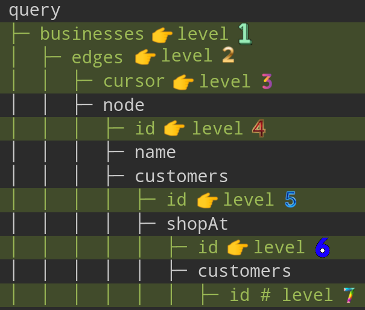

# NestJS + GraphQL

- GraphQL + TS = better type safety when writing GraphQL queries, end-to-end typing.
<!-- - We use [Apollo server](https://www.apollographql.com/docs/apollo-server). To do that we need [`@nestjs/apollo`](https://www.npmjs.com/package/@nestjs/apollo).
- We will use [Mercurius](https://github.com/mercurius-js/mercurius) which uses [Fastify](https://fastify.dev/) to implement:

  - GraphQL servers.
  - Gateways.

  For this we need [`@nestjs/mercurius`](https://www.npmjs.com/package/@nestjs/mercurius).

> [!NOTE]
>
> NestJS says in its doc that they **provide official integrations** for these GraphQL packages. That's good enough for me to pick these libs.

-->

## Schema first VS Code first

Nest offers both ways of building GraphQL applications, you can learn which one works best for you [here](https://www.reddit.com/r/graphql/comments/rvxlhx/codefirst_vs_schemafirst_approach/?utm_source=share&utm_medium=web3x&utm_name=web3xcss&utm_term=1&utm_content=share_button), and [here](https://www.reddit.com/r/graphql/comments/fpkx7a/codefirst_vs_schemafirst_development/?utm_source=share&utm_medium=web3x&utm_name=web3xcss&utm_term=1&utm_content=share_button). Regardless of which method you use, the GraphQL playground shows the schema. **My conclusion**:

-  Schema first:
  - Write your GraphQL API via SDL.
  - **Parallelize** frontend & backend development.
  - **Resembles TDD**: Think about the API rather than the implementation.
  - **Easy to read**.
  - Keep resolvers and schema in sync manually.
  - It relies on [default resolvers](./execution-from-inside.md#trivialResolvers).
-  Code first:
  - Generates the SDL from your code.
    - Use decorators and classes to generate the corresponding GraphQL schema.
  - **Single source of truth**.
  - **Generating the schema** can be done automatically as part of our **CI**.
    - [Legibility](https://dictionary.cambridge.org/dictionary/english/legibility): Types can be ordered alphabetically.
    - Can be committed to another repo like what GH does ([ref](https://github.com/octokit/graphql-schema)).
  - Enables us to **modularize schema definition**.
  - **Better dev exp**.
  - **Can do better on localization**, [related issue in GraphQL spec GH repo](https://github.com/graphql/graphql-spec/issues/193).


## Bootstrap your NestJS backend in Nx

<!-- `pnpm add @nestjs/graphql @nestjs/mercurius graphql mercurius`. -->

1. ```shell
   pnpm i @nestjs/graphql @nestjs/apollo @apollo/server graphql
   ```
2. ```shell
   nx g @nx/node:app --framework nest --directory apps/todo-nest
   ```
3. Update your `tsconfig*.json` files to use `NodeNext` instead of `CommonJS`.
4. ```shell
   nx serve todo-nest --configuration=production
   ```
5. Now you should be able to start developing your dream GraphQL in NestJS.
   - You're GraphQL IDE is available at `http://localhost:${PORT}/graphql`. Note that this is not GraphiQL. But it is their Apollo's own IDE.
   - By default, `GraphQLModule` searches for resolvers throughout the whole app. To limit this scan to only a subset of modules, use the `include` property.

> [!NOTE]
>
> It seems that NestJS does not like the idea of using esbuild, or at least we cannot use it without a lot of troubles.
>
> &mdash; [Ref](https://github.com/nrwl/nx/issues/20546).

## Create objects/mutations/queries

- Objects are what we return as a response.
- An object maps to a domain object.
  - Domain has no relation to [DDD](./domain-driven-design.md).
  - Domain refers to the specific area or subject matter that your application deals with. In other words, it's the real-world concepts and entities that your application models and interacts with.
- We need objects since our client needs to interact with those domains.

### Query

To write our queries we usually need a new object in our GraphQL API. Here is what you need to do in a code first approach:

1. ```shell
   cd apps/todo-nest
   ```
2. ```shell
   nest g module user
   nest g module todo
   ```

   I know it sucks but I did not find a better solution to use Nx's integrated CLI for NestJS.

3. ```shell
   nest g class user/models/user --no-spec
   nest g class todo/models/todo --no-spec
   ```

   Then rename it to `user.model.ts` and move it + its test file one level up. Change the `todo` too.

4. Change the newly created models the way you wanted them to be.
5. ```shell
   nest g class user/user
   nest g class todo/todo
   ```

   Move them again one level up, and rename them to `todo.resolver.ts` and `TodoResolver`. Repeat the same thing for user.

6. ```shell
   nest g service user/user
   ```

   And one more for repository, but you need to rename it so that is correct.

7. ```shell
   nx g @nx-tools/nx-prisma:configuration --project todo-nest --database postgresql
   nx g @nx/js:lib libs/shared
   ```

   In that shared lib you can add your prisma client service.

> [!TIP]
>
> <a href="#shouldWeUseResolveField" id="shouldWeUseResolveField">#</a> After a lot of back and forth regarding how to query nested fields in GraphQL I reached a conclusion. Let's start by explaining how we resolve nested fields in GraphQL:
>
> - We have `@ResolveField` in NestJS to declare a resolver for a nested field.
> - Then we also have `@Query` to annotate our main resolver (or what we call our query).
>
> So I was thinking that ah, this sucks because I'm making one or more than one extra unnecessary data fetching from database. I mean I could easily do something like this:
>
> ```ts
> prisma.todo.findFirst({
>   where: { id },
>   include: { AssignedTo: true, CreatedBy: true },
> });
> ```
>
> This is commonly known as [`N+1` issue in GraphQL](https://stackoverflow.com/a/60832838/8784518). I am not sure except writing raw queries or the [new feature of Prisma](https://www.prisma.io/blog/prisma-6-better-performance-more-flexibility-and-type-safe-sql#pick-the-best-join-strategy) what else we can do since:
>
> 1. ORMs make separate queries to fetch data and then at the application level they put them together and shave it to your taste (this is how things are usually done when you use their APIs).
> 2. The raw SQL query even for the most basic thing would be really hard to maintain. Just look at [this](https://github.com/kasir-barati/graphql-js-ts/blob/3bf93922c493350bb600141d40ad97d038aee09a/apps/todo-nest/src/todo/todo.repository.ts#L9-L41) query for fetching one todo + who has created it and if it is being assigned to someone, I want their user info too.
> 3. Another important thing here is to know that we are not modular at all. I mean this `@ResolveField` can resolve any field with that name and the same return type.
> 4. If the query is really crazy heavy then we have to write raw queries then. So we also will take care of all maintenance it brings along.
> 5. In general it is a good idea to use [`@paljs`](https://github.com/paljs/prisma-tools) since it can help us a lot with reducing the amount of data being transferred from database to our NodeJS app.
> 6. This new feature of Prisma where they use `LATERAL JOIN` is not flawless either ([learn more](https://github.com/prisma/prisma/discussions/22288#discussioncomment-11446261)).
>
> <a href="#shouldWeUseResolveFieldConclusion" id="shouldWeUseResolveFieldConclusion">#</a> **Conclusion**: I am gonna use `@paljs/plugin` for the foreseeable future :smile:. But keep in mind that there are scenarios that it might requires us to write extra code, e.g.:
>
> - An external Auth provider handles users data, therefore our app needs to fetch data from their API in a separate `@ResolveField` method:
>
>   ```graphql
>   query {
>     post {
>       id
>       title
>       # Assume user info is stored in FusionAuth.
>       user {
>         id
>         name
>       }
>     }
>   }
>   ```
>
> - Or when your pagination is following "Connections" spec. Then your query might not match exactly the underlying database. [Learn more here](./best-practices/pagination.md).

> [!TIP]
>
> **Create separate NestJS modules for each domain model**.
>
> - "Domain model":
>   - Conceptual model of specific domain of our app or its problem space.
>   - A representation of the concepts, rules, and logic of a specific [business domain](./glossary.md#businessDomainInDomainDrivenDesign).
>   - E.g., in an ECommerce app, entities such as `Product`, `Order`, `Customer`, and `Inventory` are domain models.
> - Structuring your codebase around:
>   - The core business logic.
>   - Or areas of functionality in your application.

> [!TIP]
>
> One thing that I really love about `@nestjs/graphql` is that it exports an `GraphQLISODateTime` which we can use to signify the type of date fields:
>
> ```ts
> import {
>   ObjectType,
>   GraphQLISODateTime,
>   Field,
> } from '@nestjs/graphql';
> @ObjectType('EntityName')
> export class EntityName {
>   @Field(() => GraphQLISODateTime)
>   createdAt!: Date;
> }
> ```

### Mutation

To change data on the server you need to create an `Input` object type most of the times (when the data you receive is complex) and an `Object` to show response schema:

1. Write one E2E test for it.
2. Then start with implementation:

   1. Use `@Mutation` decorator to annotate the method which will serve as your resolver.
   2. ```shell
      cd apps/todo-nest && my-touch src/todo/dto/create-todo-input.dto.ts
      ```

      To create a DTO. BTW if you do not know what does `my-touch` you can read [this](https://kasir-barati.github.io/the-pragmatic-programmer/customize-your-dev-env/my-touch.html).

   3. Write your service layer and repository layer logic for the mutation and then wire everything up.

## Query Complexity

> [!CAUTION]
>
> - First make sure to read [this doc about cost analysis](./best-practices/cost-analysis.md).
> - Only works in code first approach.

- Define how complex certain fields are.
  - A common default is to give each field a complexity of 1.
  - <a href="#complexityEstimatorFunction" id="complexityEstimatorFunction">#</a> Calculate the complexity of a query via a "complexity estimator";
    - A simple function that calculates the complexity of a field.
    - Add any number of complexity estimators to the rule, which are then executed one after another.
      - The first estimator that returns a numeric complexity value determines the complexity for that field.
- Restrict queries with a maximum complexity to prevent attack such as [DoS](./security.md#denial-of-service-attack).
- Her we're gonna use a 3rd-party packages called [`graphql-query-complexity`](https://www.npmjs.com/package/graphql-query-complexity).

### `graphql-query-complexity`

> [!NOTE]
>
> You can see the final NestJS app with query complexity configured here: `apps/complexity`. Also I wrote [a post for this topic on dev.to](https://dev.to/kasir-barati/graphql-query-complexity-nestjs-dataloader-2p2m).

1. ```shell
   pnpm add graphql-query-complexity
   ```
2. [Follow step #1 through #5](#bootstrap-your-nestjs-backend-in-nx).
3. ```shell
   nest g cl complexity-plugin --flat
   ```
4. Then write a custom "plugin" for your apollo server to calculate the complexity of a query.
5. Add the newly created class to `providers` array.
6. **Now** we can utilize:
   - The `complexity` field on a DTO.
   - Or pass a complexity estimator function.

> [!CAUTION]
>
> **Issue**: If you have nested fields and use `@ResolveField` decorator it is not gonna add up all the nested queries. So you'll end up with whatever your return from your cost estimator or the hard coded value (like what we're doing [here](https://github.com/kasir-barati/graphql-js-ts/blob/54cc54f495194f9292c4308b346e0b66d91b519e/apps/complexity/src/app/dto/user.dto.ts#L10), [here](https://github.com/kasir-barati/graphql-js-ts/blob/54cc54f495194f9292c4308b346e0b66d91b519e/apps/complexity/src/app/dto/user.dto.ts#L10), [here](https://github.com/kasir-barati/graphql-js-ts/blob/54cc54f495194f9292c4308b346e0b66d91b519e/apps/complexity/src/app/app.module.ts#L38), and [here](https://github.com/kasir-barati/graphql-js-ts/blob/54cc54f495194f9292c4308b346e0b66d91b519e/libs/shared/src/services/complexity-plugin/complexity-plugin.ts#L1-L61)).
>
> And our query is this:
>
> ```graphql
> query {
>   getPosts {
>     id
>     author {
>       posts {
>         id
>         author {
>           posts {
>             id
>             author {
>               posts {
>                 id
>                 author {
>                   id
>                 }
>               }
>             }
>           }
>         }
>       }
>     }
>   }
> }
> ```
>
> Although there is one possible fix that I had done [here](https://github.com/kasir-barati/graphql-js-ts/commit/aa6b4b8cadebca1735b24a228918976e1d8f2078). **Note, you can find an enhanced version of `apps/complexity` in `apps/dataloader-example` which reduced the amount of time needed for this query from ~5.5 seconds to ~3.7 seconds**:
>
> ```graphql
> {
>   getPosts {
>     id
>     author {
>       id
>       posts {
>         id
>       }
>     }
>   }
> }
> ```
>
> more on that [here](./best-practices/batching.md#dataloader).

> [!CAUTION]
>
> I also cannot see how you might be doing field cost analysis separately from type cost analysis and add them together to figure out the cost for a query.

## Query Depth

- A defense mechanism against unbounded deeply nested GraphQL queries.
- We need to limit the **total depth** of each operation.
- My current implementation in `apps/complexity` + [`ComplexityPlugin`](../libs/shared/src/services/complexity-plugin/) is doing just that but it lacks taking into account the Connection pagination (learn more [here](https://github.com/sonofmagic/graphql-depth-limit-ts/issues/14)).
- Deciding when a GraphQL query is "too complex" is a nuanced and subtle art.

### [`@escape.tech/graphql-armor`](https://www.npmjs.com/package/@escape.tech/graphql-armor)

> [!NOTE]
>
> At first I thought to use `graphql-depth-limit-ts`, but then I found `@escape.tech/graphql-armor`. It offers features provided by `graphql-query-complexity` and `graphql-depth-limit-ts`. So I am down :joy:.

I am gonna try this lib with `type-graphql`. **The e2e tests + app:** `apps/depth` and `apps/depth-e2e`.

1. ```shell
   pnpm install graphql type-graphql reflect-metadata typeorm pg @escape.tech/graphql-armor
   ```
2. ```shell
   nx g @nx/node:app apps/depth --framework express --bundler esbuild
   ```
3. Configure your [TypeORM](https://typeorm.io/#quick-start) and [`type-graphql`](https://typegraphql.com/docs/getting-started.html) backend.
4. Configure your `@escape.tech/graphql-armor` with your Apollo Server ([learn more](https://escape.tech/graphql-armor/docs/getting-started/#apollo-server)).

For example this query with that config will work:

<table>
<thead>
<tr>
<th>GraphQL Query</th>
<th>Config</th>
</tr>
</thead>
<tbody>
<tr>
<td>

```graphql
query {
  businesses {
    edges {
      cursor
      node {
        id
        name
        customers {
          id
          shopAt {
            id
            customers {
              id
            }
          }
        }
      }
    }
  }
}
```

</td>
<td>

```ts
new ApolloArmor({
  maxDepth: {
    enabled: true,
    ignoreIntrospection: true,
    n: 7,
    flattenFragments: true,
  },
  costLimit: {
    enabled: true,
    depthCostFactor: 1.5,
    objectCost: 2,
    scalarCost: 1,
    ignoreIntrospection: true,
    flattenFragments: true,
    maxCost: 100,
  },
});
```

</td>
</tr>
</tbody>
</table>

- We have 7 as the maximum level of nestedness. That corresponds to the `n: 7` in our `maxDepth`.

  

- After that we can take a look at how it is calculating our GraphQL query's cost, we have said `depthCostFactor` should be **1.5**, `objectCost` should be **2**, and finally `scalarCost` is **1**. Let's first break down our query

  **Cost calculation formula**: `objectCost` + (child complexity \* `depthCostFactor`). You can see how I know that this lib **at the time of writing this doc** is using this formula [here](https://github.com/Escape-Technologies/graphql-armor/discussions/754#discussioncomment-11695446).

  <table>
    <thead>
      <tr>
        <th>Depth</th>
        <th>Field</th>
        <th>Type</th>
        <th>Base Cost</th>
        <th>Child Cost * Depth Factor</th>
        <th>Total Cost</th>
      </tr>
    </thead>
    <tbody>
      <tr>
        <td>0</td>
        <td><code>query</code></td>
        <td>Object</td>
        <td>n/a</td>
        <td>n/a</td>
        <td>n/a</td>
      </tr>
      <tr>
        <td>1</td>
        <td><code>businesses</code></td>
        <td>Object</td>
        <td>2</td>
        <td>7 * 1.5</td>
        <td>12.5</td>
      </tr>
      <tr>
        <td>2</td>
        <td><code>edges</code></td>
        <td>Object</td>
        <td>2</td>
        <td>6 * 1.5</td>
        <td>11</td>
      </tr>
      <tr>
        <td>3</td>
        <td><code>cursor</code>, <code>node</code></td>
        <td>Scalar + Object</td>
        <td>1 + 2</td>
        <td>9 * 1.5</td>
        <td>16.5</td>
      </tr>
      <tr>
        <td>4</td>
        <td><code>id</code>, <code>name</code>, <code>customers</code></td>
        <td>Scalar + Scalar + Object</td>
        <td>1 + 1 + 2</td>
        <td>6 * 1.5</td>
        <td>13</td>
      </tr>
      <tr>
        <td>5</td>
        <td><code>id</code>, <code>shopAt</code></td>
        <td>Scalar + Object</td>
        <td>1 + 2</td>
        <td>3 * 1.5</td>
        <td>7.5</td>
      </tr>
      <tr>
        <td>6</td>
        <td><code>id</code>, <code>customers</code></td>
        <td>Scalar + Object</td>
        <td>1 + 2</td>
        <td>1 * 1.5</td>
        <td>4.5</td>
      </tr>
      <tr>
        <td>7</td>
        <td><code>id</code></td>
        <td>Scalar</td>
        <td>1</td>
        <td>0</td>
        <td>1</td>
      </tr>
      <tr>
        <th colspan="5">Cost Of Executing This Query</th>
        <th>66</th>
      </tr>
    </tbody>
  </table>
