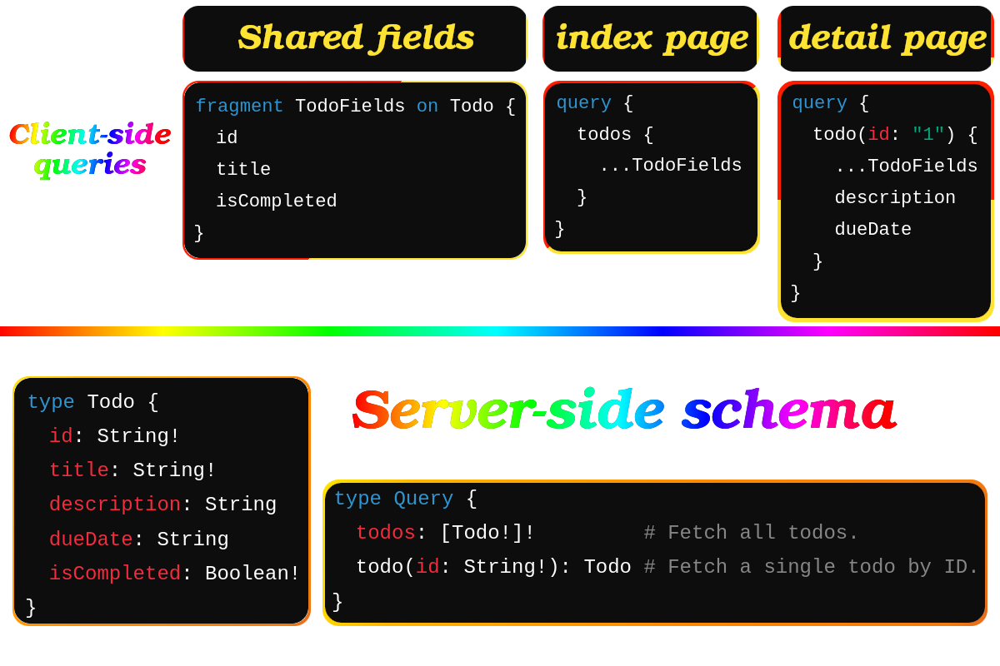
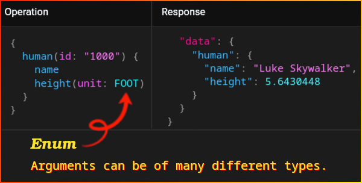
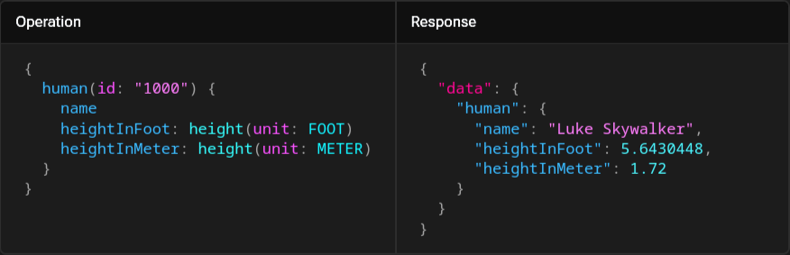
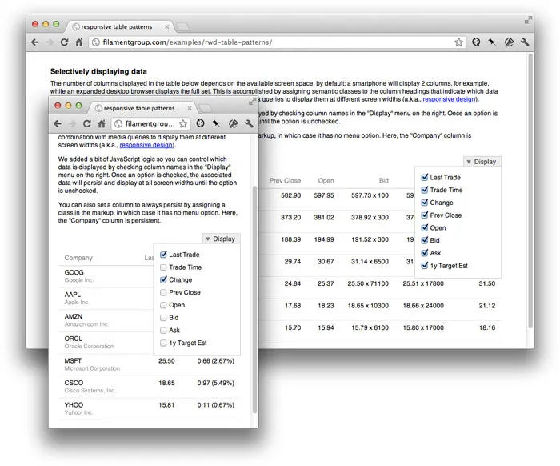
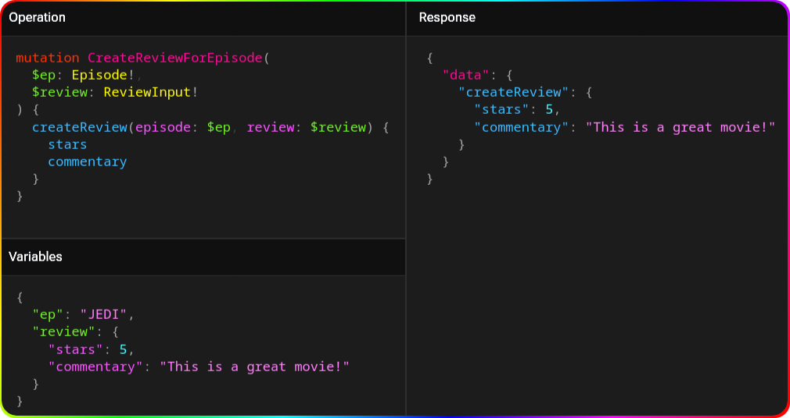
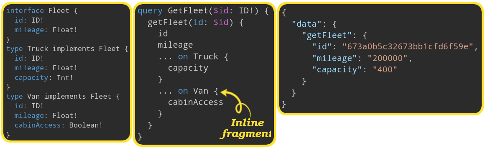
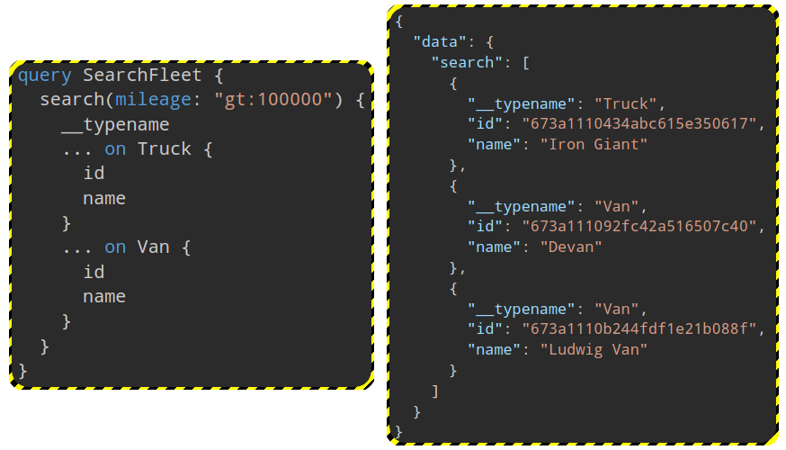

# Queries

- So we now know how to query a GraphQL server to some extend:
  - [Simplest form](../apps/expressjs-hello-world-e2e/src/expressjs-hello-world/expressjs-hello-world.spec.ts#L5).
  - [Select from sub fields of an object](../apps/todo-backend-e2e/src/todo-backend/create-todo.spec.ts#L16).
  - [Fetch a specific resource](../apps/profile-e2e/src/profile/profile.spec.ts#L11).

## Thing you can see

### Similar to WYSIWYG

[Response's shape is exactly the same as your query](./intro.md#query-what-you-need).

### Reusability -- DRY

We need to reuse parts of our queries. For sake of having an easier time to develop and maintain we can use `fragment`s. It shines where we have:

- Complex schemas.
- Consistent data structures in multiple parts of our app.

Imagine in our todo app we need to show a lot more data to the user than what we show them in index page. So our client want to be able to query specify common fields in a fragment and expand it in the query for a single todo.



You need to define fragments in your client-side app -- [ref](https://stackoverflow.com/a/48441087/8784518). And as yo how you can use this logic in your ReactJS app you can look at [this YouTube video](https://youtu.be/OSusyV3u68o?si=HQKBAEhGJv6s14ZB).

> [!TIP]
>
> You can also pass variables to your `fragment` (learn more [here](https://graphql.org/learn/queries/#using-variables-inside-fragments)).

### Variable

By using variables:

- Their type must be either:
  - Enums.
  - [Scalars](./data-types.md#basicScalarTypes).
  - [Input object](./data-types.md#inputObjectType).
- You client code do not need to serialize them into a GraphQL-specific format.
- GraphQL's [first-class way](./glossary.md#firstClassWayDefinition) to factor dynamic values out of the query.
  - By **factor out** in a dictionary, we **usually** mean to pass it as a separate key-value pair in your HTTP req (look at [this example](../apps/scalar-types-e2e/src/scalar-types/scalar-types.spec.ts#L89)).
- Denotes clearly what is dynamic and what is not.
- Never do string interpolation to construct a query with user-supplied values.
- You can define default values for them the same way you do in JS for function arguments.

  ```graphql
  query getProducts($filter: ProductFilterInput = DISCOUNT) {
    # ...
  }
  ```

- You can abstract away a lot of data transformation from clients to backend to centralize it for a smoother dev exp and user exp:



> [!NOTE]
>
> You can define any custom type, but you should define it in a representable way, in a format suitable for communication between the client and server.

## Aliases

You **cannot query for the same field with different arguments**. [Solution? **Aliases**](../apps/todo-backend-e2e/src/todo-backend/get-todo.spec.ts#L26):

    They let you rename the result of a field to anything you want. **Another use case** is when your client wants to rename fields to something that is tailor to their specific programming language.

    

## Directives

Now imagine you need to fetch data based on some conditions that will be provided by user:



[Ref for the picture](https://css-tricks.com/responsive-data-table-roundup/).

```graphql
query GetProducts(
  $filter: FilterProductsInput
  $withLastTrade: Boolean!
) {
  getProducts(filter: $filter) {
    id
    lastTrade @include(if: $withLastTrade) {
      volume
    }
    # ...
  }
}
```

We also have another directive which is `@skip`, but ATM I am failing to see any real world implication for it. But that's just me and I am pretty sure that there are use cases for `@skip` too.

> [!NOTE]
>
> - We use directives to not manipulate and change our query dynamically.
> - Server implementation can also define directives.

# Mutations

- In mutation you can specify the response you wanna get if your GraphQL service return an object.

  

## Side effects

- In RESTful APIs we have the concept of side effects and there we say that [`GET` requests should not have any side effect](https://news.ycombinator.com/item?id=29242583). But other HTTP methods can have side effects (please do not confuse this with [idempotency](https://github.com/kasir-barati/you-say/tree/main/.github/docs/glossary#idempotency)).
- In GraphQL we follow the same rule, `query` operation type should be side-effect-free while `mutation` can have side effects.

# Order of execution for specified fields

| Operation type | Execution order | Implications                                                          |
| -------------- | --------------- | --------------------------------------------------------------------- |
| `query`.       | Parallel.       |                                                                       |
| `mutation`.    | Series.         | E.g. if you call `incrementCredits` twice they run one after another. |

# Work with generic types and concrete ones -- inline `fragment`s

So assume we have 3 [interfaces](./data-types.md#interfaces--unions):

1. `Fleet` which is a generic type.
2. `Truck` which is a fleet with a concrete interface,
3. `Van` which is also a fleet with a concrete interface.

Now we wanna fetch data from a shared endpoint. We will ask for `mileage` which is something defined in Fleet. And we need to get some specific fields based on the returned interface type:

- If it is a truck we wanna add its `capacity`.
- If it is a van we need to get its `cabinAccess`.



> [!TIP]
>
> Named `fragment`s can also be used and this is not restricted to inline `fragment`s.

# Metadata

- You can ask your GraphQL service to send you back the type of object.

  
