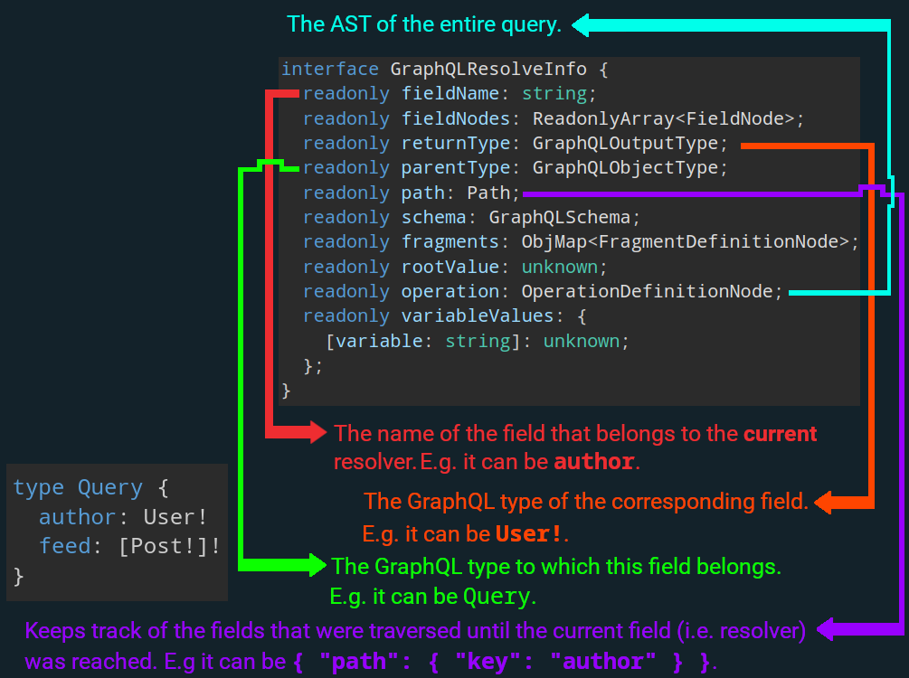

# GraphQL Resolve Info

- You can access its type like this:

  ```ts
  import { GraphQLResolveInfo } from 'graphql';
  ```

- A key on the `info` object is either:
  - Field-specific:
    - The value for that key depends on the field.
    - `fieldName`, `fieldNodes`, `path`, `rootType`, and `parentType`.
  - Global:
    - The values for these keys won't change, no matter which resolver we're talking about.
    - `schema`, `fragments`, `rootValue`, `operation` and `variableValues`.



- `fieldNodes`:

  - Contains an excerpt of the query AST.
  - This excerpt starts at the current field (i.e. author) rather than at the root of the query (The entire query AST which starts at the root is stored in `operation`).

  <details>
    <summary>It's value should be something similar to this:</summary>
    <pre lang="json">
    <code>
    {
      "fieldNodes": [
        {
          "kind": "Field",
          "name": {
            "kind": "Name",
            "value": "author",
            "loc": { "start": 27, "end": 33 }
          },
          "arguments": [
            {
              "kind": "Argument",
              "name": {
                "kind": "Name",
                "value": "id",
                "loc": { "start": 34, "end": 36 }
              },
              "value": {
                "kind": "StringValue",
                "value": "user-1",
                "block": false,
                "loc": { "start": 38, "end": 46 }
              },
              "loc": { "start": 34, "end": 46 }
            }
          ],
          "directives": [],
          "selectionSet": {
            "kind": "SelectionSet",
            "selections": [
              {
                "kind": "Field",
                "name": {
                  "kind": "Name",
                  "value": "username",
                  "loc": { "start": 54, "end": 62 }
                },
                "arguments": [],
                "directives": [],
                "loc": { "start": 54, "end": 62 }
              },
              {
                "kind": "Field",
                "name": {
                  "kind": "Name",
                  "value": "posts",
                  "loc": { "start": 67, "end": 72 }
                },
                "arguments": [],
                "directives": [],
                "selectionSet": {
                  "kind": "SelectionSet",
                  "selections": [
                    {
                      "kind": "Field",
                      "name": {
                        "kind": "Name",
                        "value": "id",
                        "loc": { "start": 81, "end": 83 }
                      },
                      "arguments": [],
                      "directives": [],
                      "loc": { "start": 81, "end": 83 }
                    },
                    {
                      "kind": "Field",
                      "name": {
                        "kind": "Name",
                        "value": "title",
                        "loc": { "start": 90, "end": 95 }
                      },
                      "arguments": [],
                      "directives": [],
                      "loc": { "start": 90, "end": 95 }
                    }
                  ],
                  "loc": { "start": 73, "end": 101 }
                },
                "loc": { "start": 67, "end": 101 }
              }
            ],
            "loc": { "start": 48, "end": 105 }
          },
          "loc": { "start": 27, "end": 105 }
        }
      ]
    }
    </code>
    </pre>
  </details>

- `path`:

  <table>
    <thead>
      <tr>
        <th>GraphQL Query</th>
        <th><code>path</code> when resolving <code>Post.title</code></th>
      </tr>
      <tr>
        <td>
  <pre lang="graphql">
  <code>
    query AuthorWithPosts {
      author {
        posts {
          title
        }
      }
    }
  </code>
  </pre>
        </td>
        <td>
  <pre lang="json">
  <code>
  {
    "path": {
      "prev": {
        "prev": { 
          "prev": { "key": "author" },
          "key": "posts"
        },
        "key": 0
      },
      "key": "title"
    }
  }
  </code>
  </pre>
        </td>
      </tr>
    </thead>
  </table>

- `operation`:

  <details>
    <summary>It's value should be something similar to this:</summary>
    <pre lang="json">
    <code>
    {
      "operation": {
        "kind": "OperationDefinition",
        "operation": "query",
        "name": { "kind": "Name", "value": "AuthorWithPosts" },
        "selectionSet": {
          "kind": "SelectionSet",
          "selections": [
            {
              "kind": "Field",
              "name": { "kind": "Name", "value": "author" },
              "arguments": [
                {
                  "kind": "Argument",
                  "name": { "kind": "Name", "value": "id" },
                  "value": { "kind": "StringValue", "value": "user-1" }
                }
              ],
              "selectionSet": {
                "kind": "SelectionSet",
                "selections": [
                  {
                    "kind": "Field",
                    "name": { "kind": "Name", "value": "username" }
                  },
                  {
                    "kind": "Field",
                    "name": { "kind": "Name", "value": "posts" },
                    "selectionSet": {
                      "kind": "SelectionSet",
                      "selections": [
                        {
                          "kind": "Field",
                          "name": { "kind": "Name", "value": "id" }
                        },
                        {
                          "kind": "Field",
                          "name": { "kind": "Name", "value": "title" }
                        }
                      ]
                    }
                  }
                ]
              }
            }
          ]
        }
      }
    }
    </code>
    </pre>
  </details>

- `variableValues`:

  ```json
  { "variableValues": { "userId": "user-1" } }
  ```
