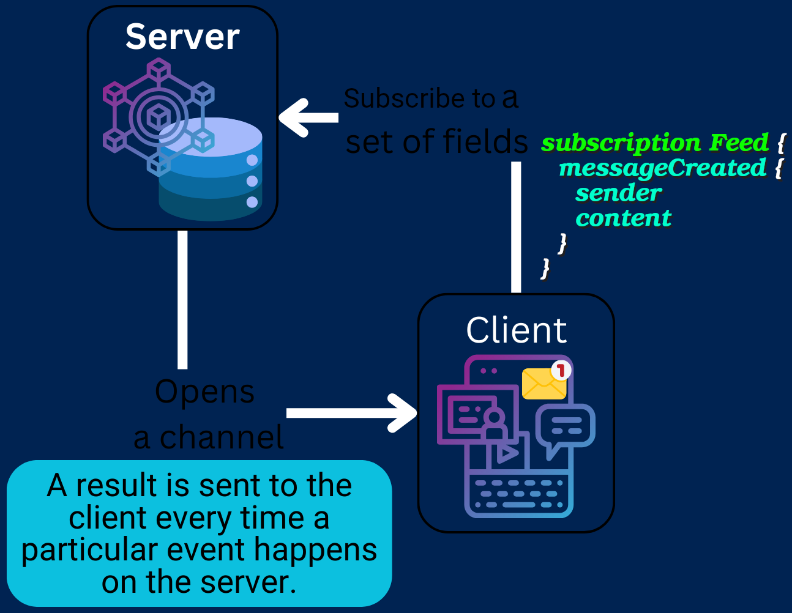
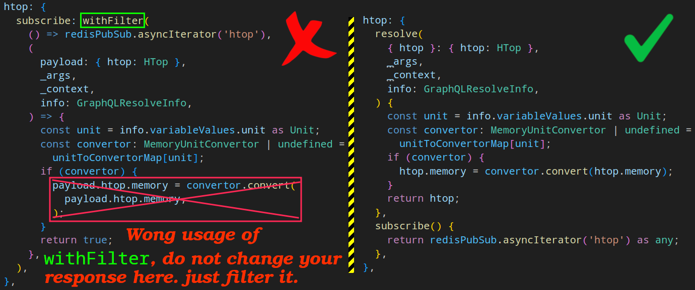
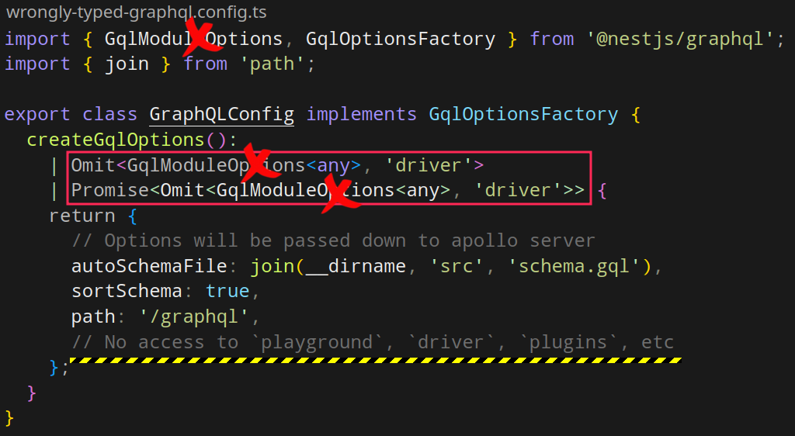
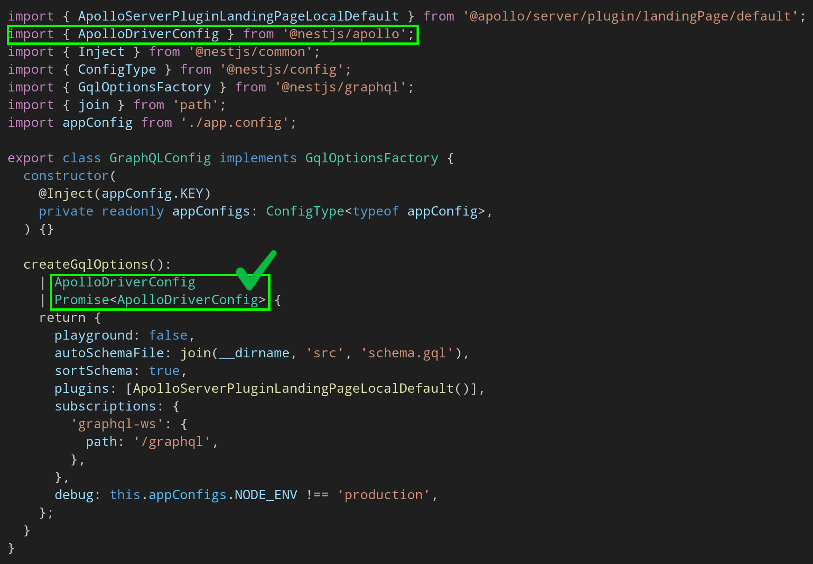

# Subscription

- In GraphQL you can:
  - Fetch data using `Query` operation type.
  - Modify/insert data using `Mutation` operation type.
- But if you need to push data from the server to the clients, that choose to listen to real time messages from the server, you need to use `Subscription` operation type.
- More complex to implement, so first [make sure that you need it](https://github.com/kasir-barati/awesome-js-ts/blob/main/docs/websockets.md#scenarios-where-we-need-websockets).
- Subscription: long-lasting GraphQL read operations that can update their result whenever a particular server-side event occurs.
  - Done through [the WebSocket protocol](https://developer.mozilla.org/en-US/docs/Web/API/WebSockets_API).

## How `Subscription` operation type works

- They're similar to `query` operation types.
- It defines top-level **fields that clients can subscribe to**:
  ```graphql
  type Subscription {
    # messageCreated field will update its value whenever a new Message is
    # created on the backend, thus pushing the Message to subscribing clients.
    messageCreated: Message
  }
  ```
- Open a channel in the backend on the server.
- A result is sent to the client every time a particular event happens on the server.



> [!IMPORTANT]
>
> Each `subscription` operation can subscribe to only one top-level field of the `Subscription` type. Meaning the following subscription operation is not valid:
>
> ```graphql
> subscription IndexPageEvents {
>   notificationCreated {
>     id
>   }
>   postCreated {
>     author
>     comment
>   }
> }
> ```

## `@apollo/server`

- **No** built-in support for subscriptions.

### Subscription resolvers

- Return an object.
- Define a subscribe function.
- Publish an event whenever the return value of a subscription should be updated.
  - It can be triggered by:
    - A mutation.
    - A cron job.
    - etc.
- You can [see how it is done in NodeJS + ExpressJS + Apollo server here](https://github.com/kasir-barati/graphql-js-ts/tree/main/apps/server-statistics).
- You need to enable CORS in your backend.
  - [Learn more about CORS here](./security.md#cross-origin-resource-sharing----cors).
- Do not forget to set up HTTP body parsing
  - [In NestJS it is by default activated](https://docs.nestjs.com/faq/raw-body).
  - In ExpressJS just `app.use(express.json())`.
- To filter data you can use `withFilter` function.
  - Runs before the `resolve` function.
  - Returns early if the filter does **NOT** pass.
  - Accepts two functions:
    - The first is your usual subscribe which has to return an `AsyncIterator` object.
    - The second function though is where you write extra logic to narrow what should be sent to the client based on their query.

> [!TIP]
>
> Here you can see how `withFilter` should **NOT** be used in [AS](./glossary.md#asAcronymStandsFor):
>
> 

### NestJS + Apollo server

- Define a new `Subscription`
  - This name is either:
    - Inherited from the name of the subscription handler method (e.g., `commentAdded`).
    - Is provided explicitly by passing an option with the key name as the second argument to the `@Subscription()` decorator.

1. Enable subscription in [AS](./glossary.md#asAcronymStandsFor).
   - We need a 3rd-party lib for it called [`graphql-ws`](https://www.npmjs.com/package/graphql-ws).
2. ```diff
    GraphQLModule.forRoot<ApolloDriverConfig>({
     driver: ApolloDriver,
     autoSchemaFile: join(__dirname, 'src', 'schema.gql'),
     sortSchema: true,
   +  subscriptions: {
   +    'graphql-ws': true,
   +  },
   })
   ```

   > [!CAUTION]
   >
   > You cannot use `GqlOptionsFactory` as your return type. It is a generic type and in our case we wanna use `ApolloServer` as our driver, but if you use it then you won't be able to access properties such as `subscriptions`:
   >
   > 
   >
   > And here is how you do should do it instead:
   >
   > 

3. Use `@Subscription` to annotate your handler.
4. ```shell
   pnpm add graphql-subscriptions
   ```

   - Provides a simple publish/subscribe API.
   - We usually need to back it with an external store such as Redis, or RabbitMQ, or anything other database ([See a more complete list here](https://github.com/apollographql/graphql-subscriptions?tab=readme-ov-file#pubsub-implementations)).
     - ```shell
       pnpm add graphql-redis-subscriptions @nestjs/config ioredis class-transformer class-validator
       ```
     - For docker I am using [this `compose` file](https://github.com/kasir-barati/docker/blob/main/docker-compose-files/redis).
     - ```shell
       cd libs/shared && nest g module pubsub
       ```

5. To publish an event, we use the `pubsub.publish` method.
   - Often used within a mutation to trigger a client-side update when a part of the object graph has changed.
   - BTW it is also possible to use [_Javascript function generators_](https://developer.mozilla.org/en-US/docs/Web/JavaScript/Reference/Statements/function*) instead. Like what we did for `greet` subscription.
6. If you need to pass arguments to your field you need to utilize `@ResolveField`.
   - And if you need to access to the response you can use `@Parent`.
