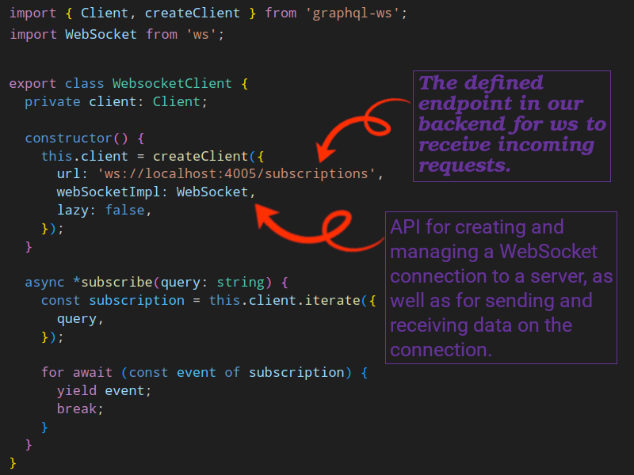

# Testing out GraphQL API

## Integration testing subscriptions

- We need a client which connects to my subscription endpoint.
- [Read `graphql-ws` documentation](https://the-guild.dev/graphql/ws/get-started#use-the-client) to see how to create a client.
  - `graphql-ws` is a [GraphQL over WebSocket spec](https://github.com/enisdenjo/graphql-ws/blob/master/PROTOCOL.md) compliant server and client.
- Create a websocket client helper, for the written version of it you can find it in `apps/server-statistics-e2e/src/support`:

  

- Then the rest is your normal tests. You can see how to write one in e2e tests for `apps/server-statistics-e2e`.
